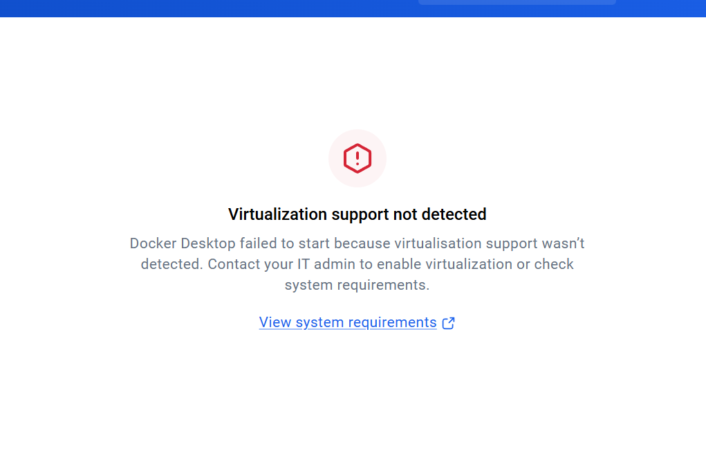
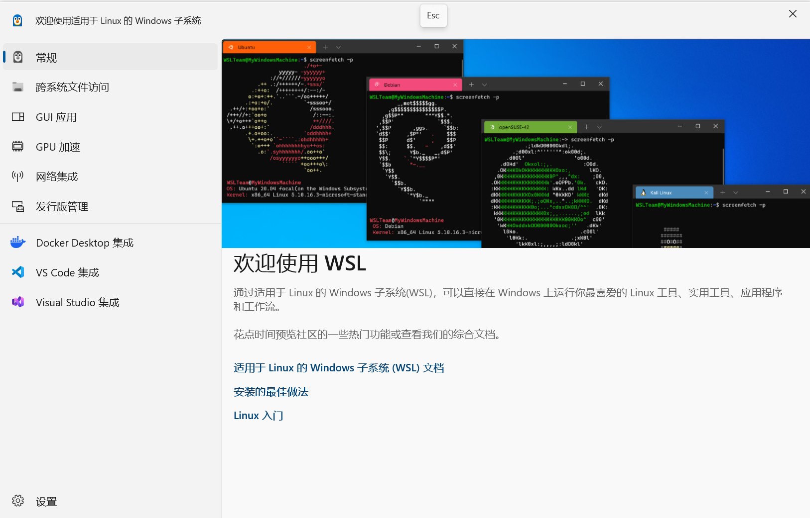

一个元比赛，编写一个自主ai agent。让这个agent去做数据科学的活

比赛机制：

提交一份agent.yaml配置文件，定义一个基于Google ADK的LLM agent

评测的时候，会启动一个离线的Docker 沙箱容器，把某个数据集的train.csv/test.csv丢进去，agent在里面自主预测

能用的工具

run_command—执行shell命令

write_file / edit_file 写代码

submit_predictions 提交预测拿public分数

select_submission 选最终提交

get_status 查剩余预算

大概流程:

设计agent → validate_submission.py校验配置 → run_local_eval.py在16个练习集上跑本地评测 → 看trace调试agent的行为 → 打包提交到Kaggle看public榜。

## baseline

[https://www.kaggle.com/code/ryanholbrook/autonomous-agent-prediction-beta-demo-agent](https://www.kaggle.com/code/ryanholbrook/autonomous-agent-prediction-beta-demo-agent/output)

这个demo

### 整体架构

主agent

sub_agent

skill

agent.yaml (ml_agent, model: gemini-3.5-flash)
├── tools: run_command, write_file, edit_file, submit_predictions, select_submission, get_status
├── agent_tool: tools/data_analyst.yaml  ← EDA外包给专门的sub-agent
└── skills: skills/feature-engineer      ← 打包好的特征工程脚本

#### sub_agent

data_analyst的prompt(prompts/data_analyst.md)明确规定了EDA要覆盖的8个维度(shape/schema、target分布、缺失值、特征类型、分布统计、相关性、train/test分布差异、潜在问题)强调"用表格和bullet point,别写大段文字”

为了控制sub-agent返回结果的token开销。还特别声明"不要建模,只做分析",职责边界很清晰。

#### skill

调用方式

```python
run_skill_script(
    skill_name="feature_engineer",
    script_name="generate_features.py",
    args="--train train.csv --test test.csv --target target",
)
```

#### system prompt

几条比较好的策略

**用光所有允许的提交次数,别提前结束**

**警告public score只是test set的一个子集,最终分数在private子集上,要防止对public榜过拟合**

**强调优先简单模型和计算效率,让tool call快速返回**

#### skill resource

把checklist做成一个独立的资源文件，通过load_skill_resource按需加载，这样不占用固定token预算,agent需要时才读

## 环境准备

### 虚拟环境

[环境准备](/notes/kaggle-env-setup/)

### 模型key

要先有api的key和模型

我用的是两个模型

gemini-3.5-flash
gemini-3-flash-preview

是中转站的api

baseurl是[https://api.gpt.ge](https://api.gpt.ge/)

### docker

安装docker desktop

```jsx
winget install --id Docker.DockerDesktop -e --source winget

```

打开docker desktop时候出现了一个问题



待解决

已解决

重启电脑就解决了



打开powershell 运行以下命令

.\.venv312\Scripts\python.exe run_local_eval.py   `--submission-dir submissions/01_demo_baseline/agent`
--dataset train_01   `--metric roc_auc`
--max-time-minutes 10   `--max-budget-usd 1`
--max-submissions 3

结果给我c盘爆满了

草

需要在docker 的设置里面改，改成d盘之后，运行

```jsx
docker pull gcr.io/kaggle-images/python:latest
```

安装好之后，再跑

.\.venv312\Scripts\python.exe run_local_eval.py   `--submission-dir submissions/01_demo_baseline/agent`
--dataset train_01   `--metric roc_auc`
--max-time-minutes 10   `--max-budget-usd 1`
--max-submissions 3

### 运行过程

#### 我的电脑

run_local_eval.py
├── 启动/管理 Docker 沙箱
├── 编译 Agent 配置
├── 通过中转站调用 LLM
└── 记录评测结果

#### Docker 沙箱

└── Autonomous Agent
├── 查看 train.csv / test.csv
├── 编写并运行机器学习代码
├── 生成预测文件
├── 提交预测
└── 选择最终提交

#### 具体运行命令解析

run_local_eval.py之后会运行

load_dotenv()

读取项目根目录的.env

然后读取数据集

train.csv：给Agent训练使用
test.csv：给Agent生成预测使用
sample_submission.csv：检查预测文件格式
solution.csv：本地评测器内部使用，用来计算分数

模型读取

models.yaml 保存了比赛允许使用的模型及价格

程序为每个模型创建一个LiteLLM客户端

我们使用的是中转站的api

#### docker

评测器使用Docker镜像 

http://gcr.io/kaggle-images/python:latest

Docker容器是Agent的隔离运行环境，Agent实际执行代码的地方不是你的Windows PowerShell，而是这个Linux容器。容器里预装了很多环境

`pandas
numpy
scikit-learn
xgboost
lightgbm
catboost
torch
tensorflow`

Agent通过run_command执行Python代码时，代码会在容器中运行

#### agent配置

程序读取

submissions/01_demo_baseline/agent/agent.yaml
它会

1：读取主Agent的模型  

```jsx
model: gemini-3.5-flash

```

主Agent负责整体决策：

决定先做什么
选择模型
编写训练代码
比较实验结果
提交预测
选择最终结果

2：加载主提示词

submissions/01_demo_baseline/agent/prompts/system.md

`instruction: !include prompts/system.md`

这个文件告诉主Agent：

这是一个二分类任务
优化ROC AUC
需要先EDA
要用交叉验证
要尝试多个模型
要记录submission ID
最后调用select_submission
要定期调用get_status

3：注册内置工具

agent有大部分工具

`run_command`

可以在docker里面执行命令，运行Python训练脚本，创建训练脚本、预测文件，修改已有代码，提交预测CSV并获得一个分数和submission ID，选择最终提交到私有榜的候选结果

4：注册EDA子Agent

主agent通过调用

D:\zlf\kaggle\autonomous-agent-prediction-beta\submissions\01_demo_baseline\agent\tools\data_analyst.yaml
这个配置使用

model: gemini-3-flash-preview
这个model负责

查看数据形状
检查数据类型
检查缺失值
检查类别数量
检查目标分布
检查训练集和测试集分布差异
给出建模建议

提示词在

D:\zlf\kaggle\autonomous-agent-prediction-beta\submissions\01_demo_baseline\agent\tools\prompts\data_analyst.md

主Agent会先调用它，然后根据返回的EDA报告决定后续建模方式

### 一次典型的Agent运行过程

主agent

step1

评测器把任务上下文注入Agent

问题描述
评价指标
时间限制
token预算
提交次数

step2

调用EDA子Agent调用EDA子Agent

主Agent发出发出“先让data_analyst检查数据结构和分布”然后调用agent_tool(data_analyst)，EDA子Agent再使用run_command在Docker里面执行Python分析代码，读取

train.csv
test.csv
sample_submission.csv

分析结果返回给主Agent

step3

主Agent决定建模方案

根据EDA结果，主Agent选择不同的建模方案

step4

创建训练脚本

主Agent通过write_file工具写出训练脚本，再执行

step5
运行多个实验

主Agent会尝试多个不同模型

step6

使用feature-engineer skill

D:\zlf\kaggle\autonomous-agent-prediction-beta\submissions\01_demo_baseline\agent\skills\feature-engineer

Agent配置中包含

skills:

- skills/feature-engineer

这个skill的作用是给Agent提供一个预先写好的特征工程脚本，脚本会尝试

对数值列做训练集拟合的中位数填充
对类别列做众数填充
添加数值特征的行均值
添加数值特征的行标准差
添加缺失数量统计

输出

train_engineered.csv
test_engineered.csv

step7

提交预测

主Agent调用submit_predictions("submission_01.csv")

评测器会检查：

文件是否存在
列名是否和sample_submission一致
行数是否一致
row_id是否匹配
是否存在重复ID
target是否是有效预测值
如果格式正确，就返回

submission_id: sub_1
score: 0.89

主agent会进行记录

step8

继续迭代，最多提交三次

## First run
