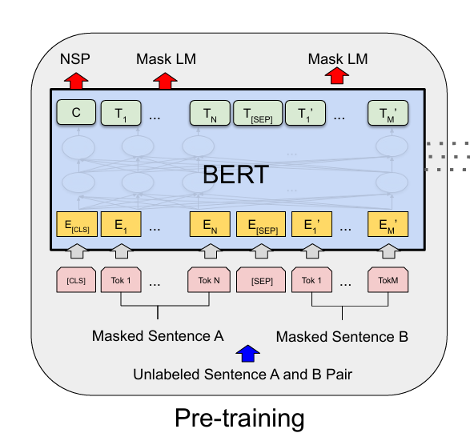
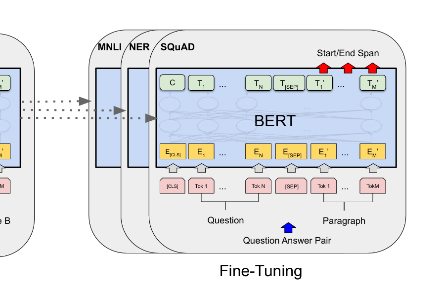
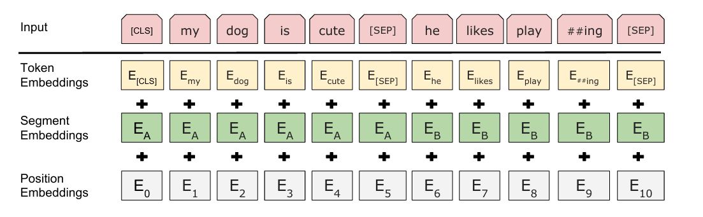

## 摘要

基于pre-training的方法有两种：

feature-based    ——-ELMo基于RNN结构,把特征和输入放到一起

fine-tuning     ———-GPT，模型微调权重放到不同的底层数据上面

语言模型是单向的，在模型选择上会有局限性，比如GPT是从左到右

所以我们为了减轻单向的局限，选择了一个带掩码的语言模型

训练了两个模型

1：可以从双向看，预测中间的掩码

2：预测下一个句子是不是相连的

## 相关工作

### 非监督的ELMO

### 非监督的GPT

### 数据集

natural   language  inference

machine translation

两块比较大的数据集，在这里训练之后做迁移学习。

在CV上这个比较常见，在image-net训练，然后迁移学习到其他样本上

### trick

没有标号的数据也许训练效果更好

## algorithm

### pre-training

在没有标号的数据里面去训练

### fine-tuning

用一个权重被初始化为我们预训练中得到的权重，所以的权重在微调中都会得到训练，用的是有标号的数据，每一个下游模型都会有一个bert模型

## 架构

### 输入（在预训练和微调里面都一样）

可以是一个句子，也可以是多个句子—合称为一个序列

#### 切词

方法是wordpiece embedding，最后一共只有30000个token

序列的第一个词永远是【cls】

两个句子合在一起怎么做句子层面的分类

**1：在每个句子后面加一个【sep】**

2：嵌入一个可学习的embedding块

每个词元的embedding有三层

1：本身的embedding

2：在哪个句子

3：位置

### pre-training

#### Masked LM

对一个输入的词元序列，都有15%的概率成为一个掩码

但是有一个问题，在做掩码的时候，会把词元替换成一个【MASK】，但是在微调的时候没有【MASK】,导致在预训练和微调的时候看到的数据不一样

解决方法：对于15%的被选中的词

1：有80%的概率真的被替换

2：10%的概率被随机换成另外的次元用来做预测

3：10%的概率什么都不变

#### Next Sentence Prediction

输入序列有两个。A和B，

50%的概率A和B相连，50%的概率不相连

#### 数据集

BooksCorpus

English Wikipedia

### Fine-tuning

微调比较便宜

#### GLUE

？？

epoch选的稍微高一点
