## 数据增广

### 数据增强

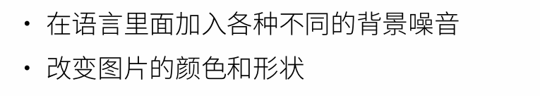

一般是在线生成

##### **常见的数据增强**

**反转**

**切割**

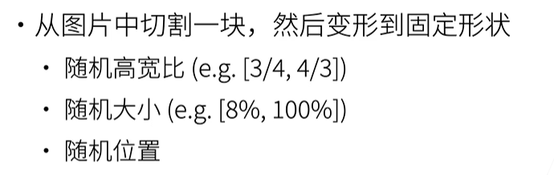

形状需要固定，因为模型的输入是固定的

**改变颜色**

色调，饱和度，明亮度

还有很多其他的办法

### QA

## 微调

### 背景

标注一个数据集很贵

### 架构

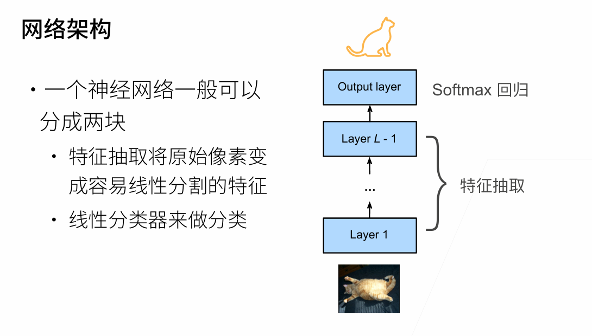

微调相当于前面特征提取不变，但是最后的回归需要变化，因为标号变化了

### 权重初始化

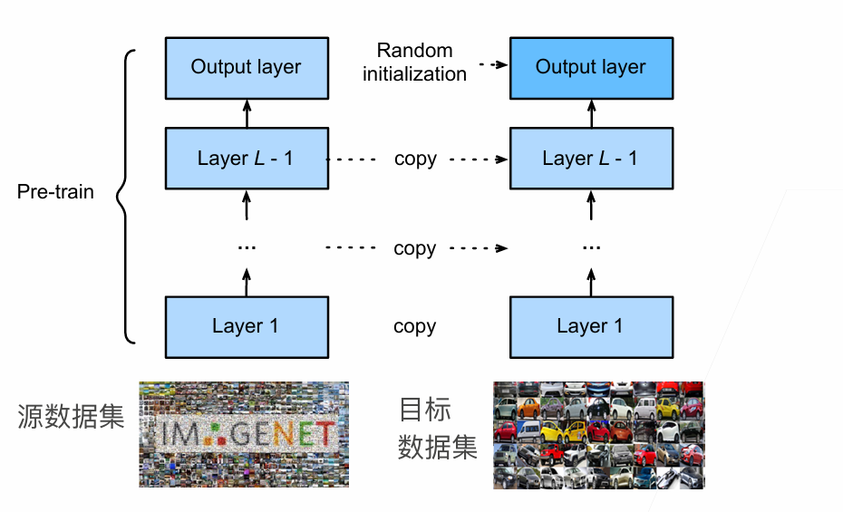

### 固定一些层

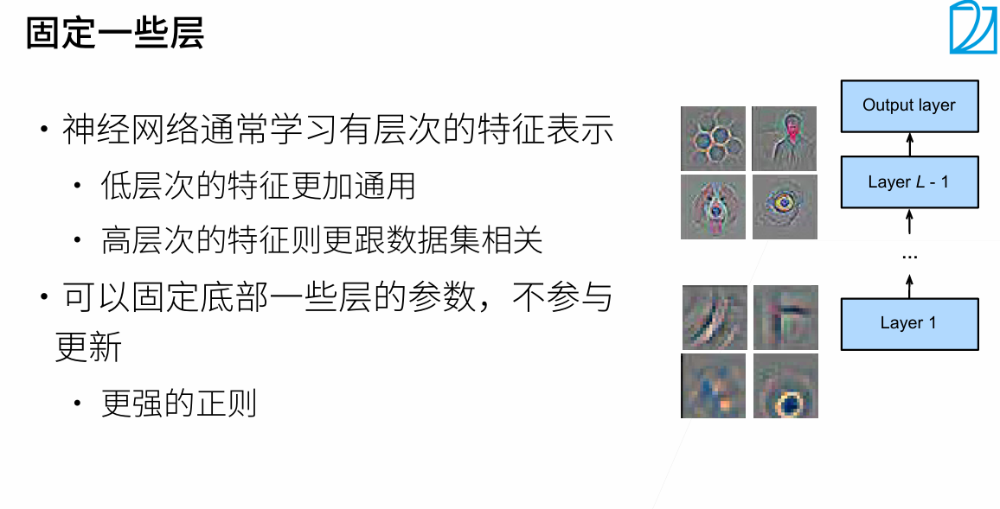

### QA

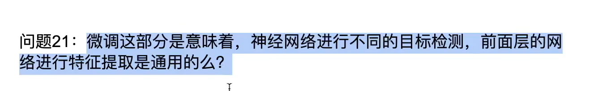

对

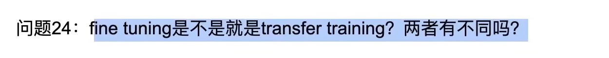

没有不同，微调就是迁移学习

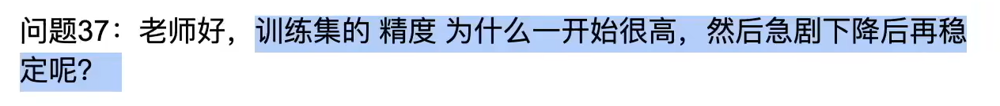

随机的

## 目标检测

### 边缘框

一个边缘框用四个数字就能表示，一边是左上和右下

### 数据集

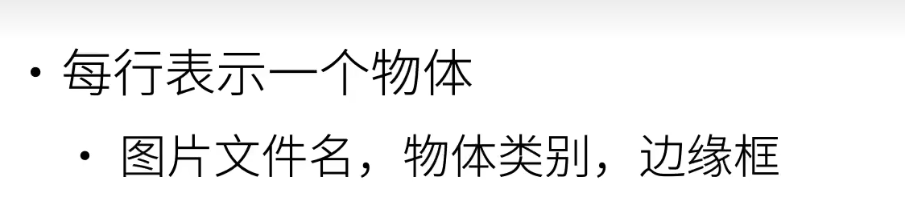

常用的目标检测数据集是coco

### QA

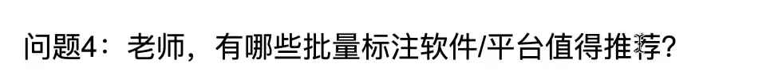

no，自己先标几百张图片，然后再用迁移学习，然后去预测图片，把预测的概率低的图片拿出来重新标一下

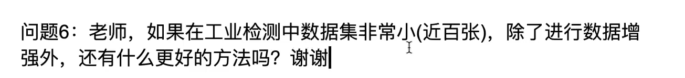

用迁移学习，有几百张图片已经够用的

## 锚框

主流的目标检测算法

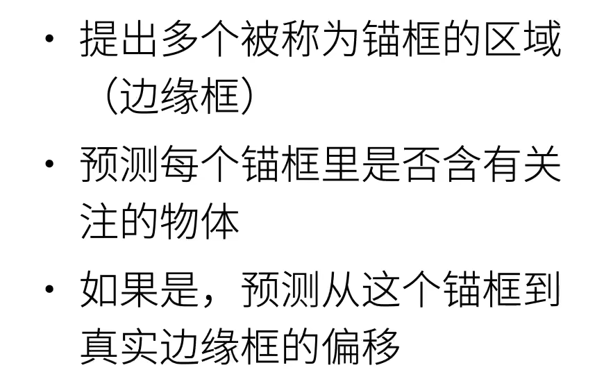

### IOU

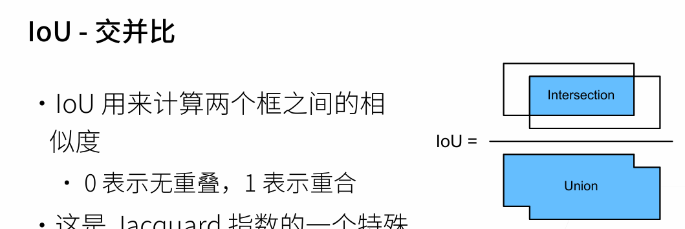

### 问题

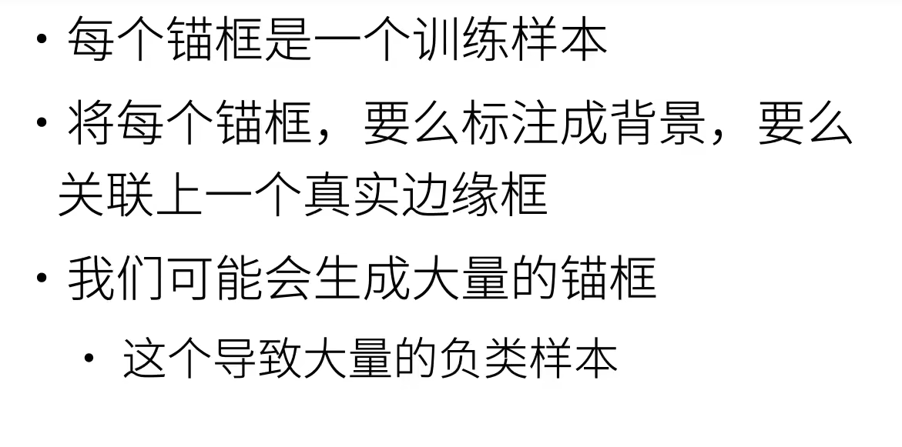

### 赋予锚框标号的过程

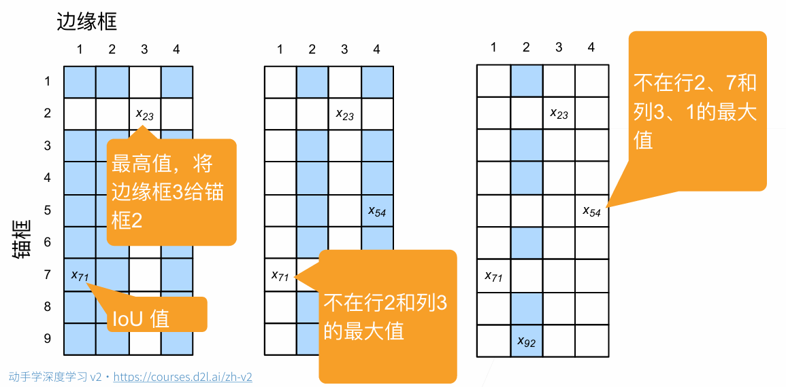

### NMS输出

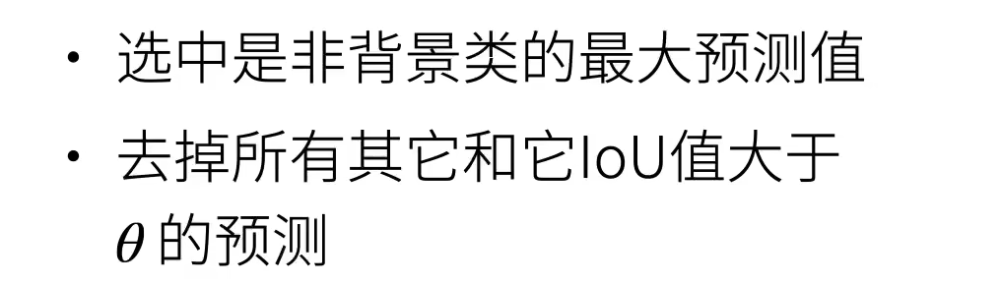

其实就是去掉冗余的预测

## 经典目标检测神经网络

### R-CNN

奠基性的网络

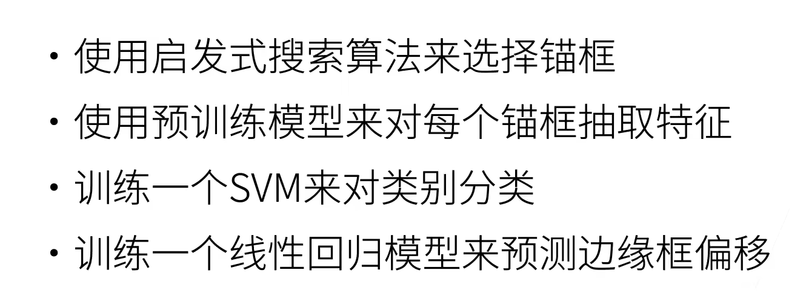

#### ROI Pooling

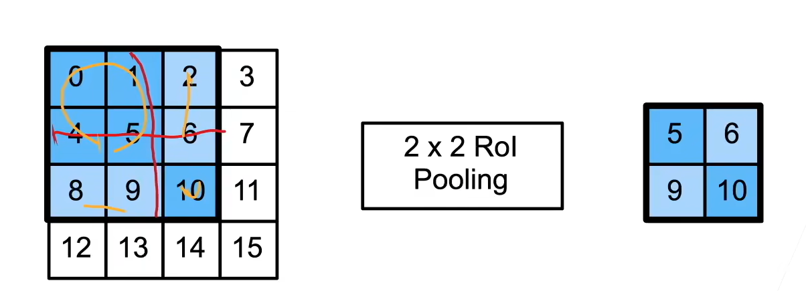

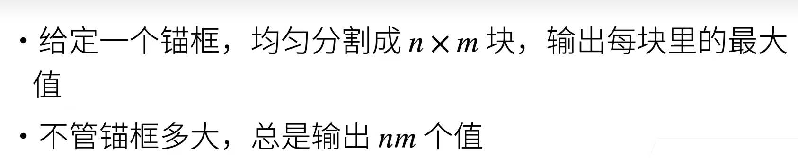

### Fast RCNN

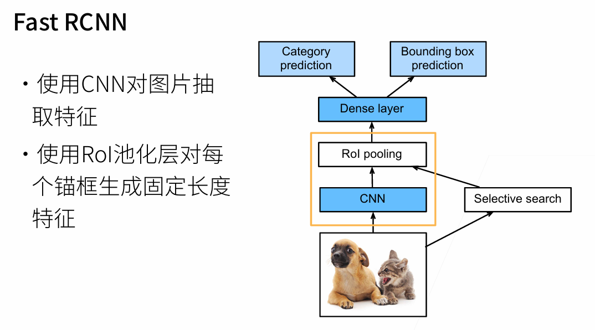

一次抽取完所有的锚框

### Faster RCNN

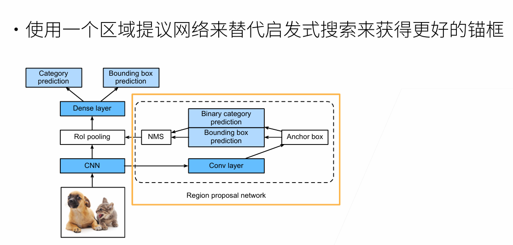

### Mask R-CNN

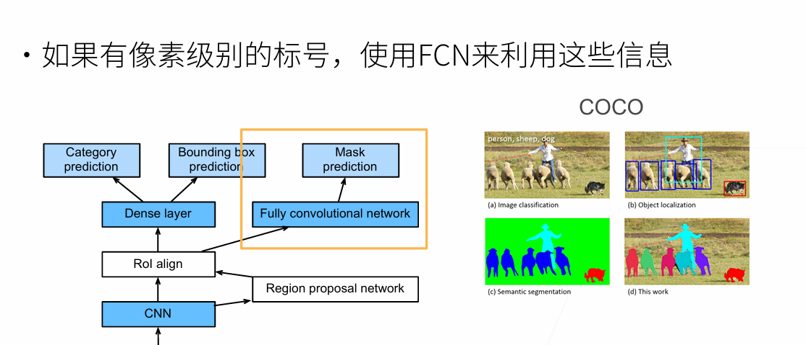

**map：预测的精度**

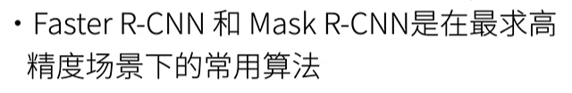

### SSD(Single Shot Detect)

**通过单神经网络来检测模型**

#### 架构

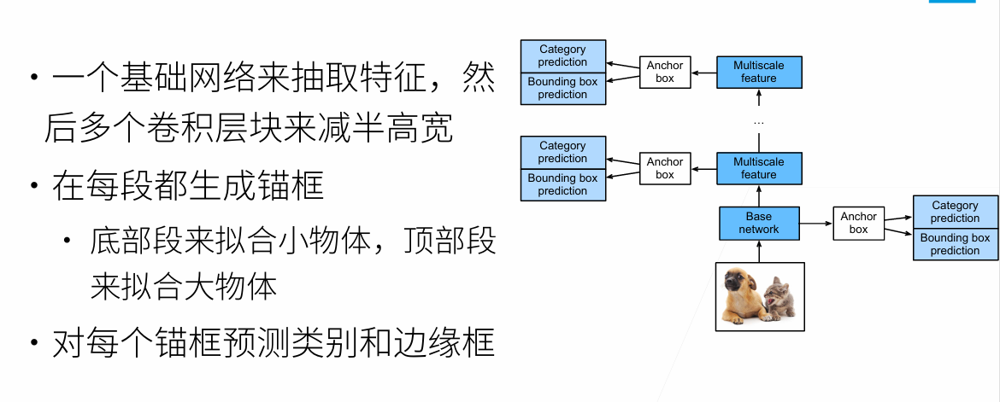

### Yolo

因为SSD有很多锚框重复

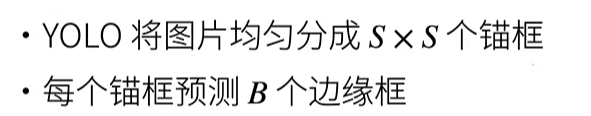

每个锚框可以预测不同的边缘框，不同的物体
