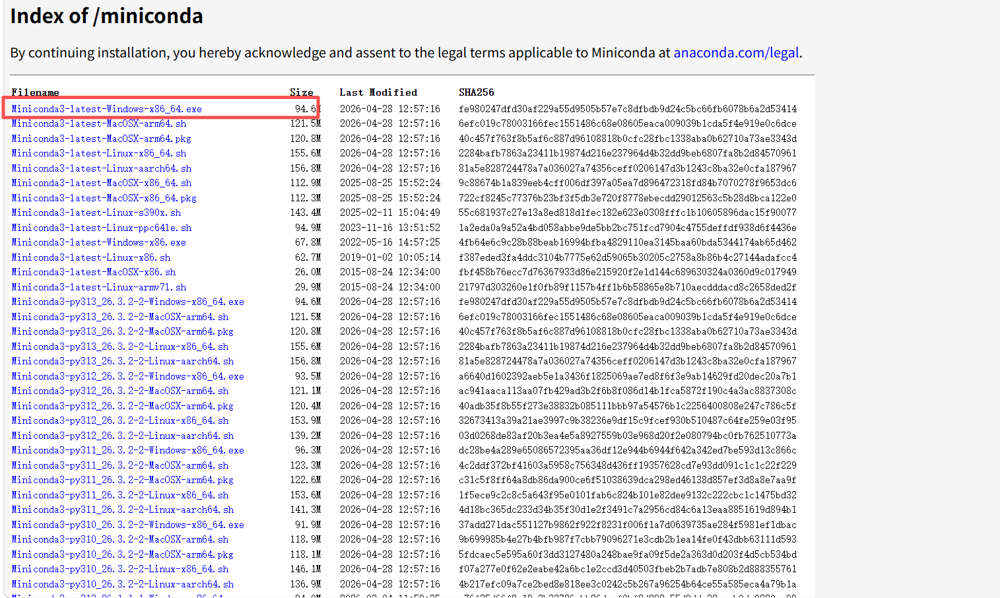
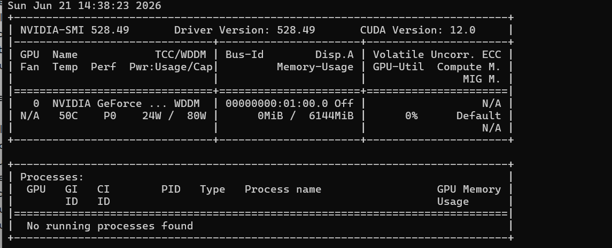
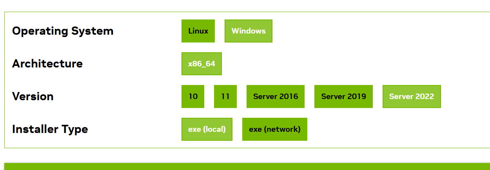
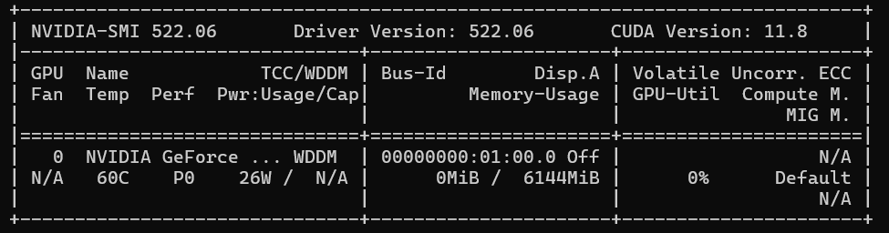
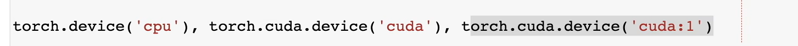

1：miniconda

[Miniconda 安装与环境配置全流程图解（2025 最新版） - 知乎](https://zhuanlan.zhihu.com/p/1978239735307708129)

进入[Miniconda - Anaconda](https://www.anaconda.com/docs/getting-started/miniconda/main)，然后点击[**https://repo.anaconda.com/miniconda**](https://repo.anaconda.com/miniconda).

我选择下载最新的一版

双击打开安装包

搜索anaconda prompt就能打开

2：python

C:\Users\zlf\AppData\Local\Python\bin\python.exe 这是我安装的全局python地址 版本是3.14.6

D:\deeplearning\env\miniconda\python.exe 这是miniconda里面自带的python，版本是3.13.13

3：激活d2l

前面是失败了，因为没有同意三个条款，然后挂代理也会遇到失败的问题，所以需要取消代理

conda create --name d2l python=3.13 -y

conda activate d2l

4：安装cuda

首先看电脑GPU驱动版本和CUDA最高能支持的版本，我下载的是11.8

5：下载课程代码和常见的包

python3.13太新了，下载包出错，所以需要给conda里面的python降级，然后再重新下一下试试

*conda deactivate
conda env remove -n d2l -y*

*conda create --name d2l python=3.9 -y*

*conda activate d2l*

*conda install pytorch torchvision torchaudio pytorch-cuda=11.8 -c pytorch -c nvidia -y*

*pip install d2l==0.17.6 jupyter*

课程代码放在了`D:\deeplearning\env\doc`

`cd /d D:\deeplearning\env\doc\pytorch` 

`jupyter notebook`

但是运行失败了，原因是 Windows 系统底层有一个损坏的 SSL 幽灵证书

解决办法：在*D:\deeplearning\env\miniconda\envs\d2l\lib\[ssl.py](http://ssl.py/)*

文件最后一行加上

`def enum_certificates(store_name):
return []`

目的是：强制屏蔽 Windows 损坏的系统证书库，直接使用 Conda 自带的健康证书

6：python

输入python，即可进入python环境

输入exit(),即可退出python环境

要安装一些库需要退出python环境

7：GPU

使用nvidia-smi命令可以看到自己电脑的GPU

cuda == gpu，下面是一些硬件描述的工具，来使用GPU

程序是默认跑在CPU上，所以需要通过函数把tensor存到GPU上，要进行张量操作时，需要把数据都放到同一个GPU上

data最好在训练之前的最后一步传到GPU上比较好，把数据预处理放到GPU上

训练==算梯度

推理==forward
