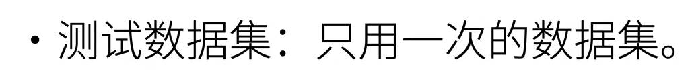
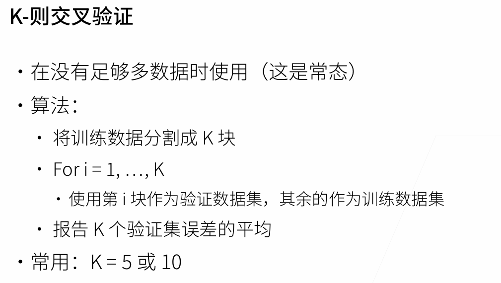
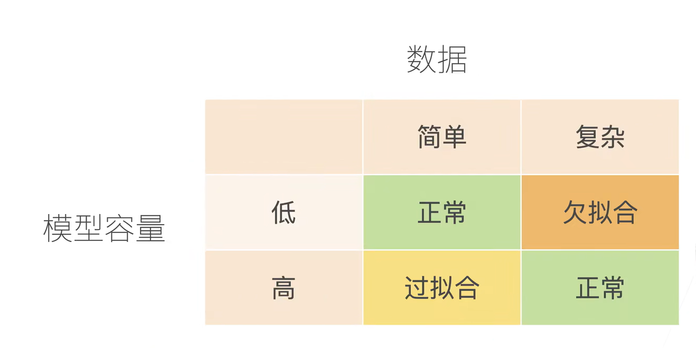
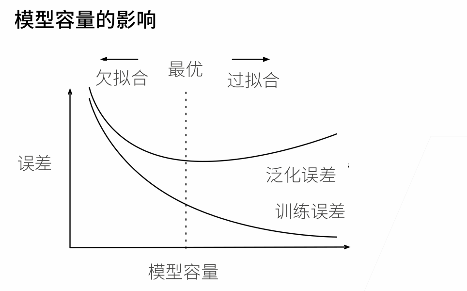
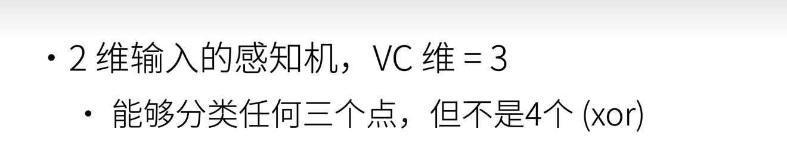
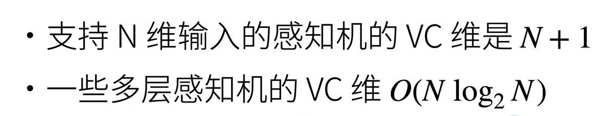
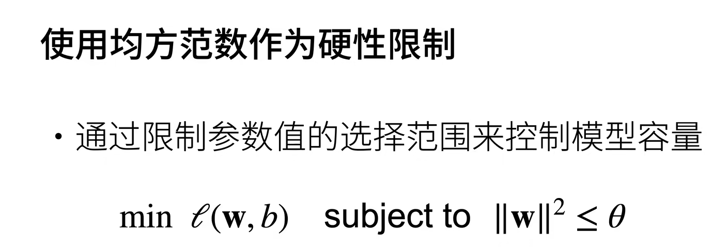
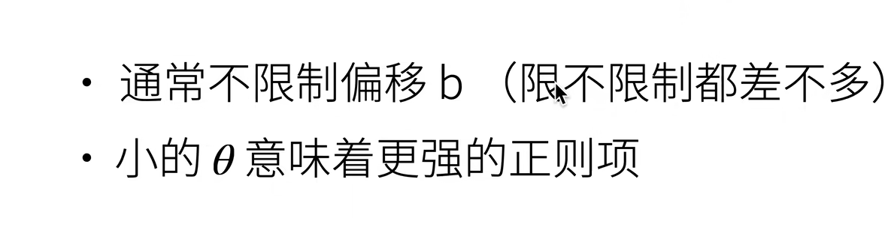
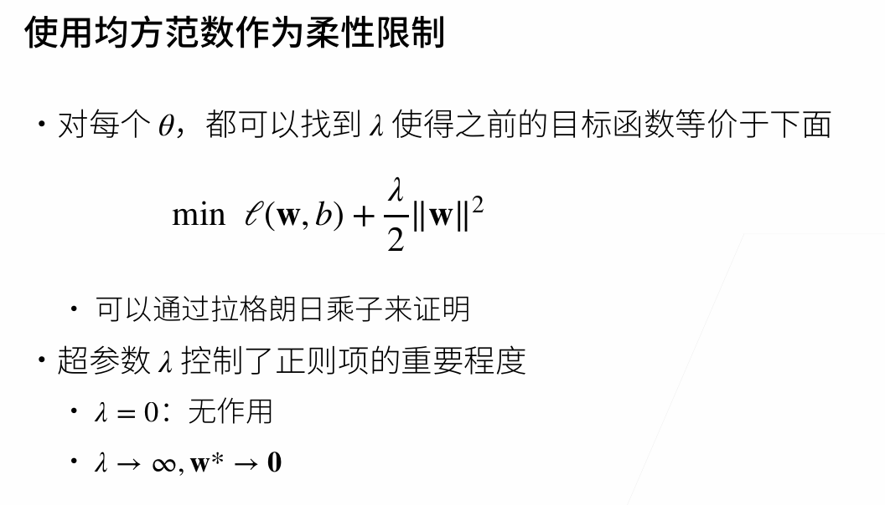
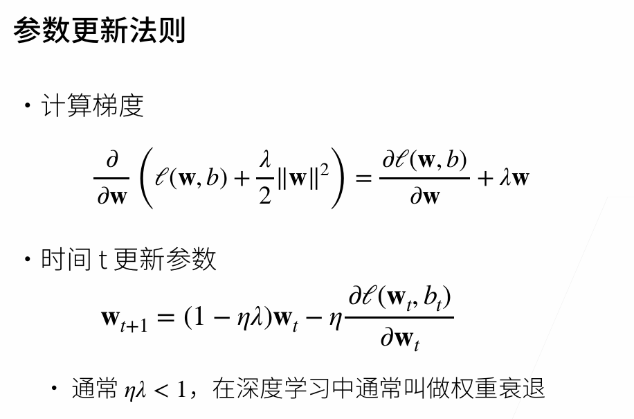

## 验证数据集

一定不能和训练数据集混在一起

## 测试数据集

## k则交叉验证

当没有足够多的数据时，我们使用k-则交叉验证

## 过拟合和欠拟合

## VC维

## QA

SVM的缺点做不了大的数据，能调的东西不多

神经网络的优点：本质上是一种语言

时序上的数据，按照时间，前面的是训练集，后面的是验证集

做数据清洗时，最好将训练数据和验证数据同意做清洗

## 权重衰退

处理过拟合的办法—通过一个正则项，使得模型参数不会过大，从而控制模型复杂度

**硬性限制**

**柔性限制**

参数更新

（其实和梯度下降一样，唯一不一样的是在Wt前面多了一个参数）

