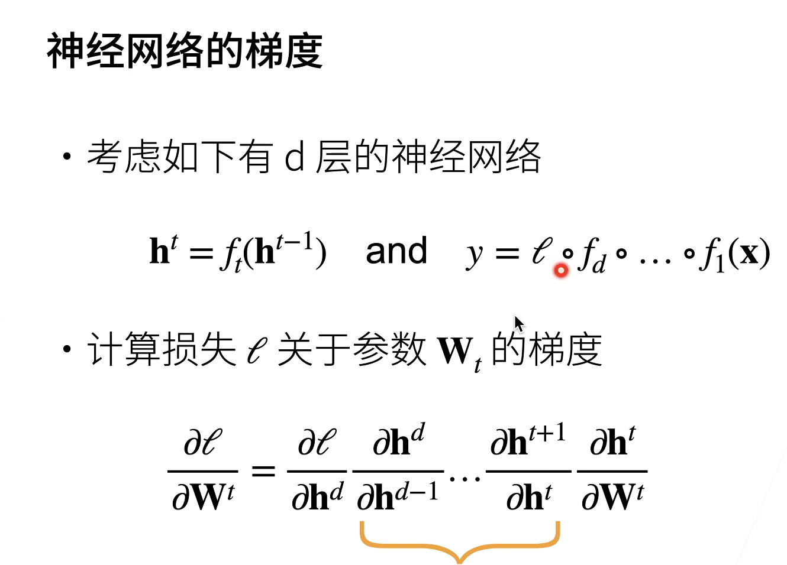
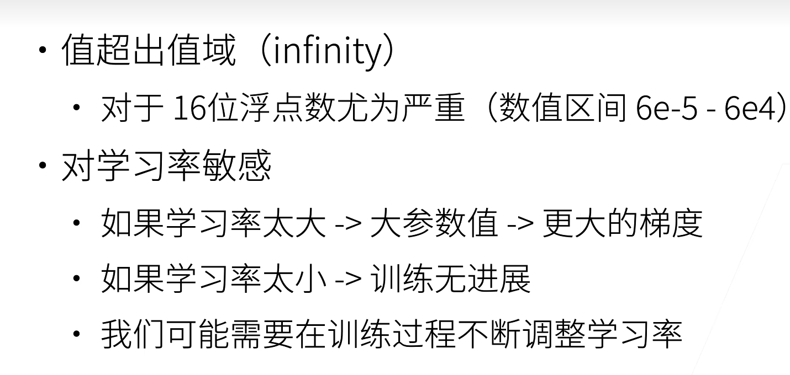
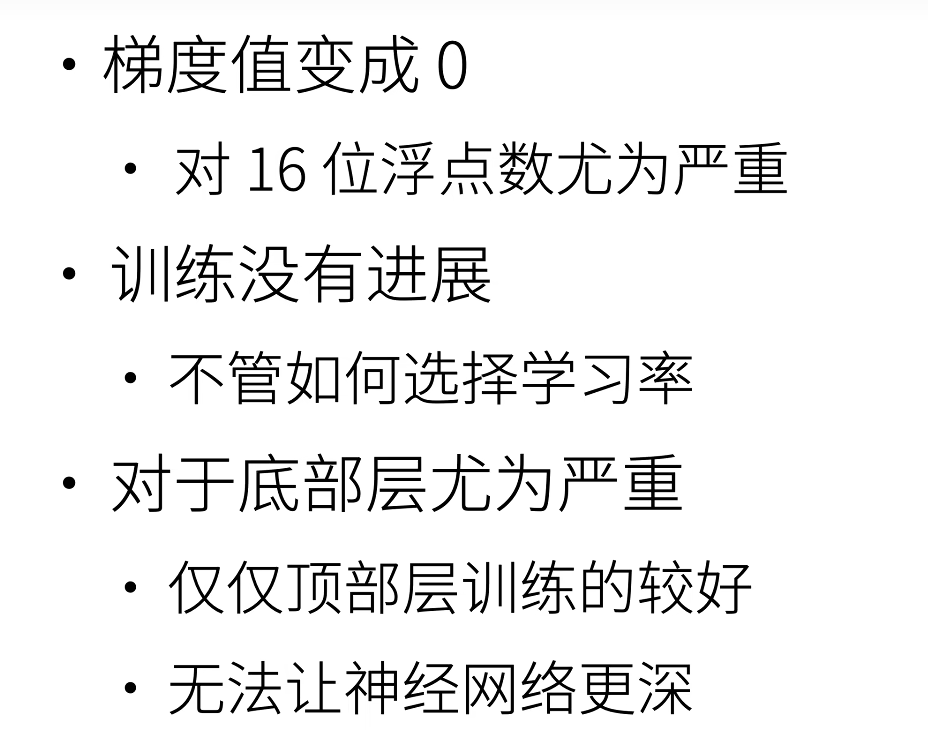
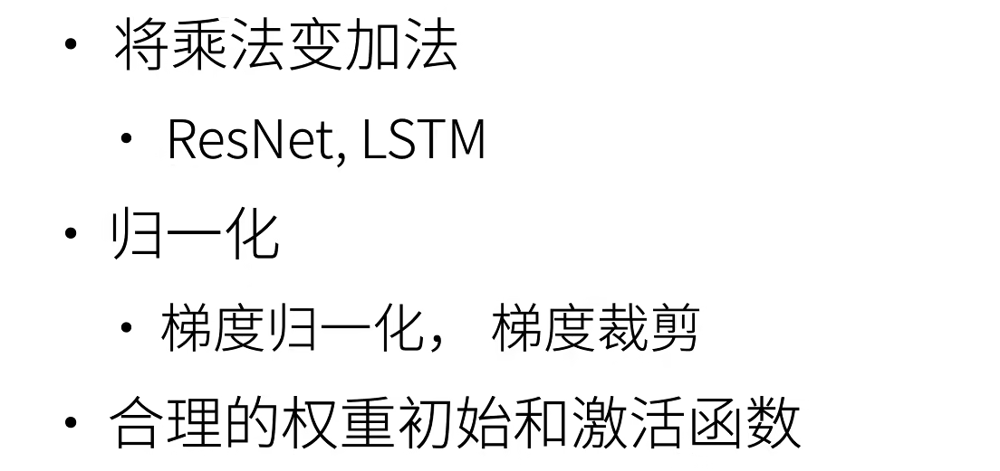
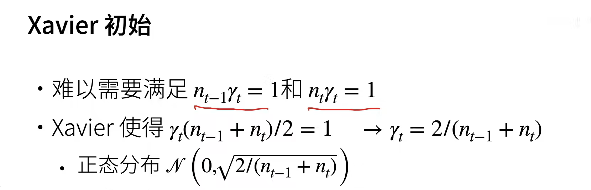
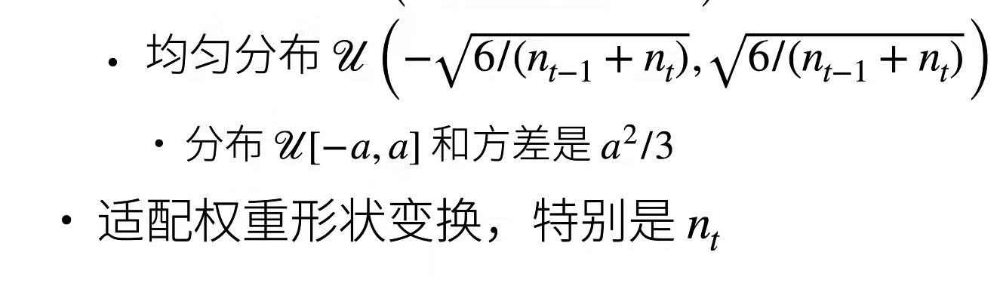
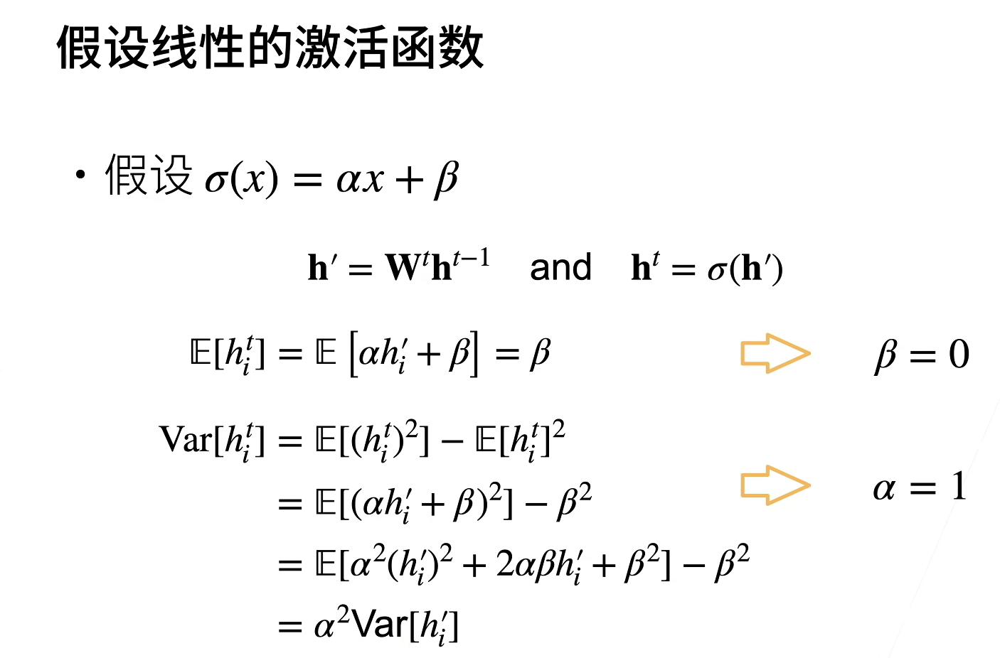
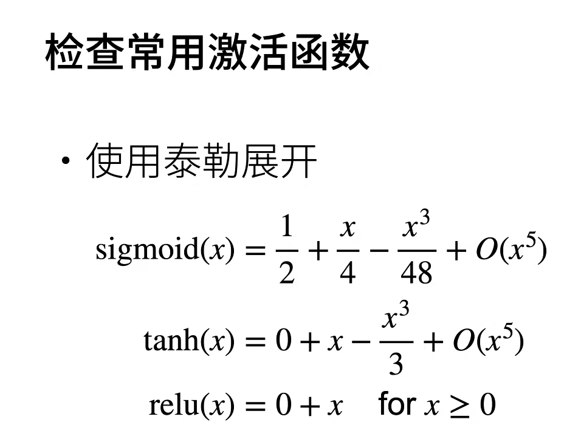
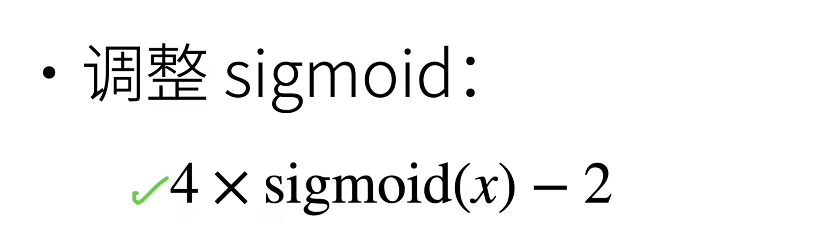

中间向量对向量的导数实际上是在做矩阵乘法

## 数值稳定性的两个问题

当数值太大或者太小的时候会导致数值问题

### 梯度爆炸

### 梯度消失

## how to 让训练更加稳定

### 权重初始化

让每一层的方差是一个常数
将每层的输出和梯度都看做是随机变量，让他们的均值和方差都保持一致

我们不希望太小或者太大

***其实没太看懂***

### 激活函数

这个其实挺好看懂的

**所以就需要激活函数是它本身 y=x**

在零点附近，tanh和relu都满足y=x

但是sigmoid不满足，所以需要做调整

