---
title: '感知机+激活函数'
date: '2026-07-06'
tags: ['深度学习', '李沐课程']
draft: false
---
## **输入输出**

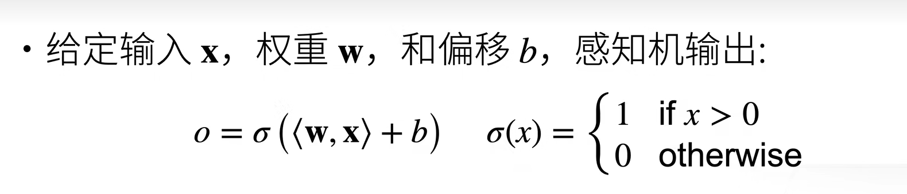

和回归输出的比较：回归输出的是实数，感知机输出的是离散的类

和softmax输出的比较：感知机只能做一个二分类的问题，softmax输出的是多个概率

## 算法

## 问题

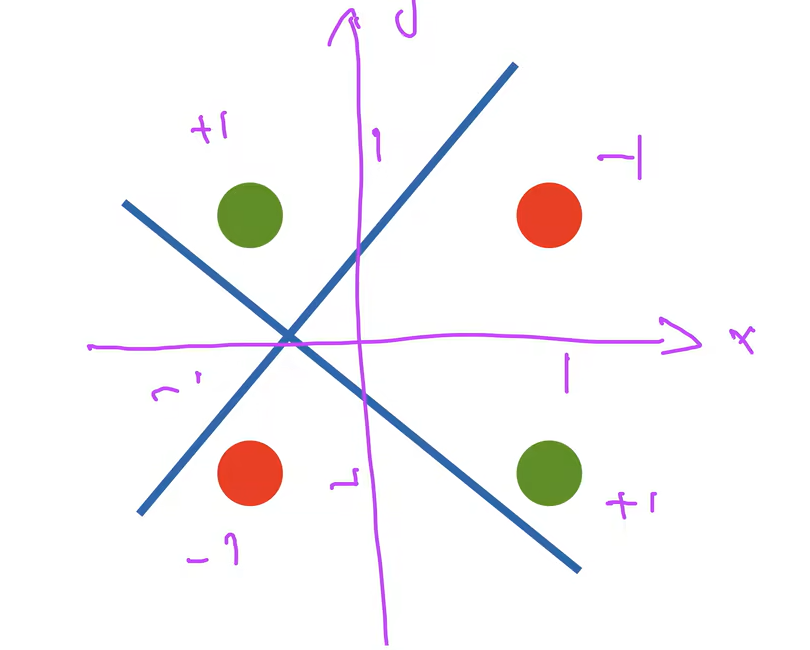

红色和绿色不能同时分割

## 多层感知机（解决了XOR问题）

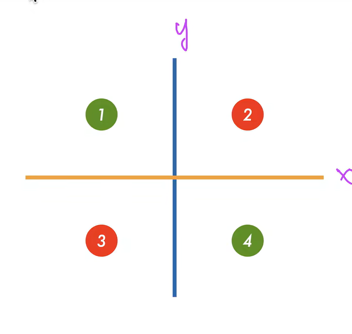

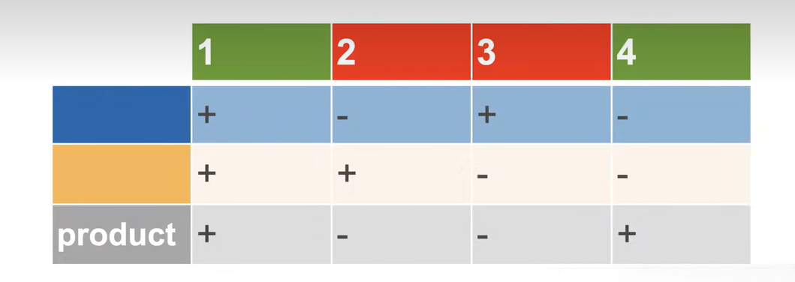

蓝色线和橙色线分开看，然后取一个交集得到最后输出

## 单分类

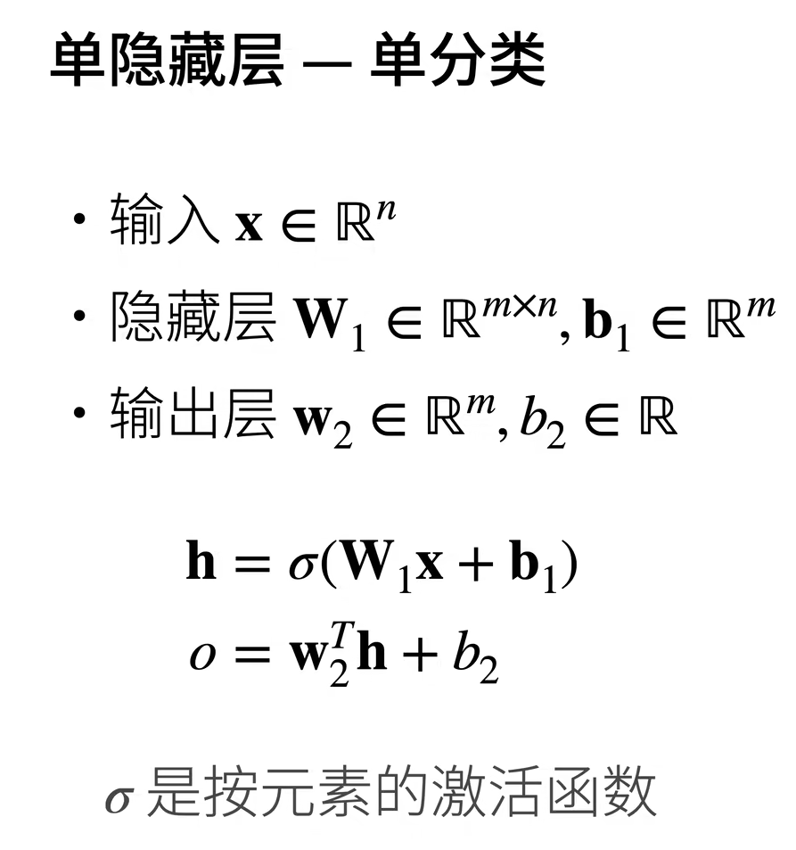

h是输入输出中间的隐藏层，o是输出层，最后是一个标量

## 激活函数

激活函数的本质就是引入一个非线性性

**why 激活函数不能是一个线性函数**

cause:

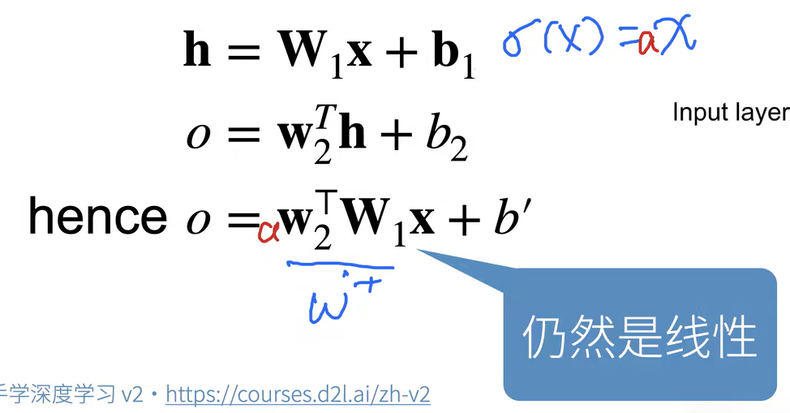

这样的话输出依旧是线性，就变成了单层感知机

**一些激活函数举例**

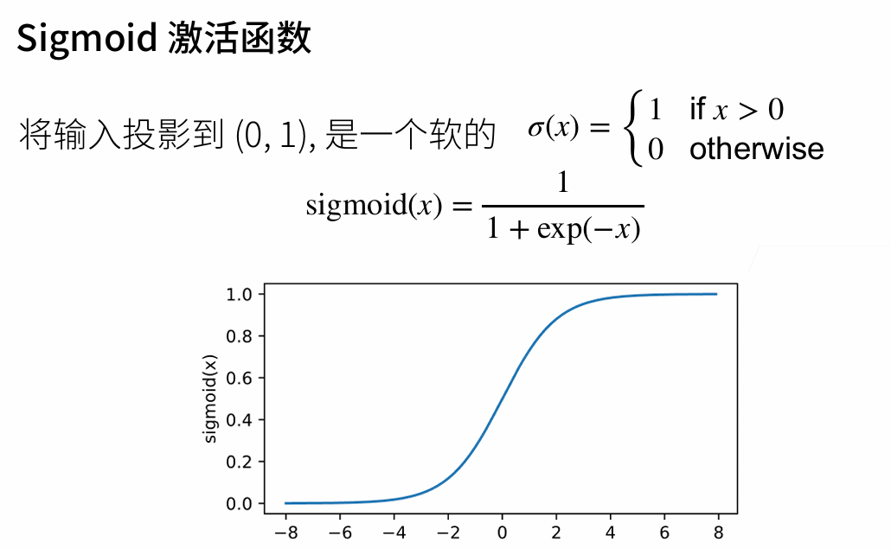

为什么要软化呢？这样可以方便求导

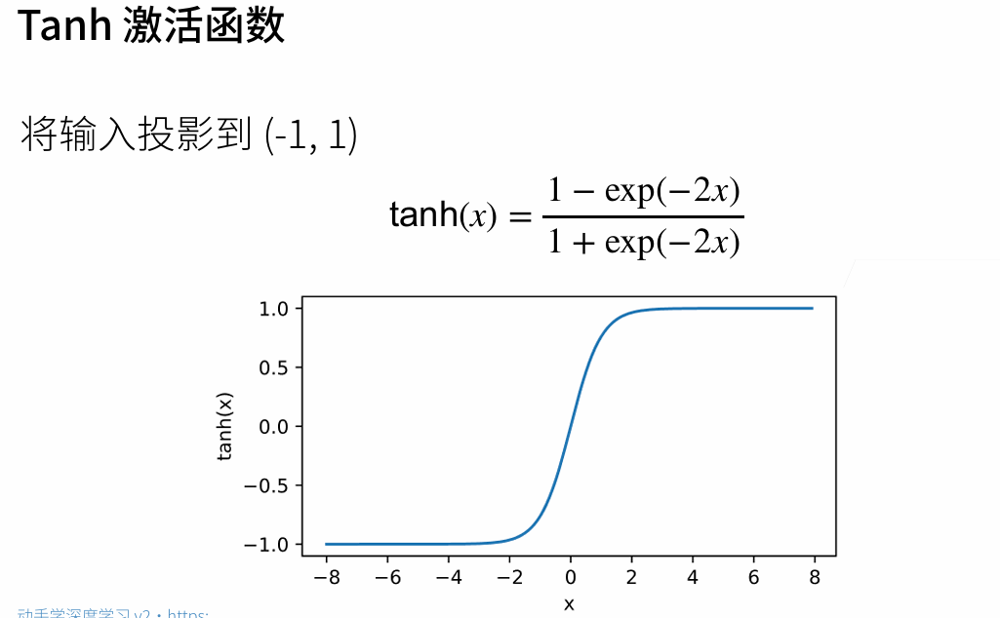

为什么要取2呢？不确定

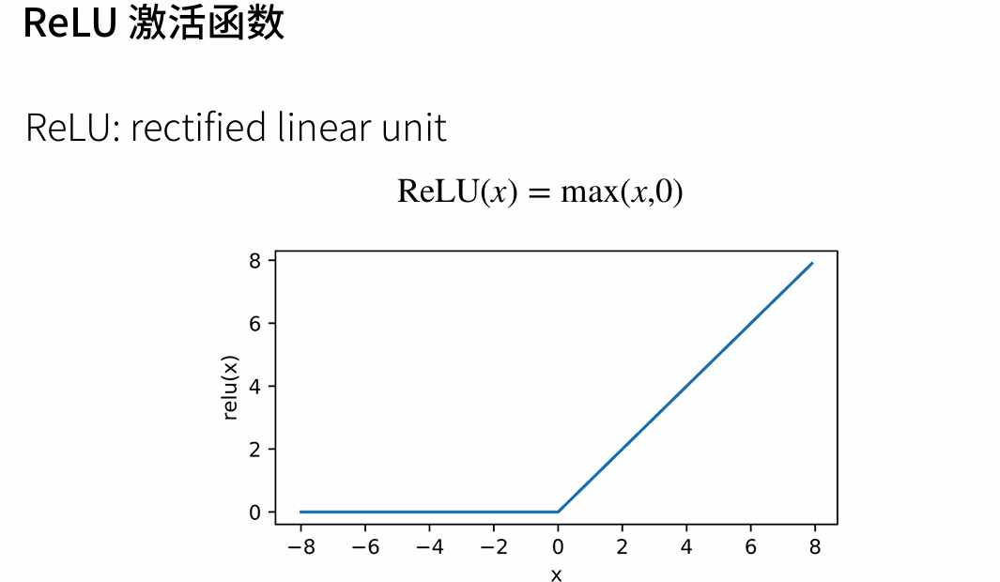

好处是不用做指数运算

## 多类分类

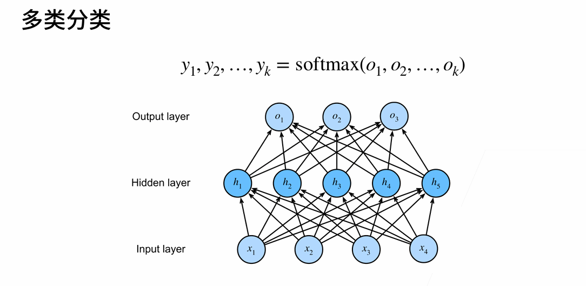

去掉隐藏层的话其实直接就是softmax模型

## 多隐藏层

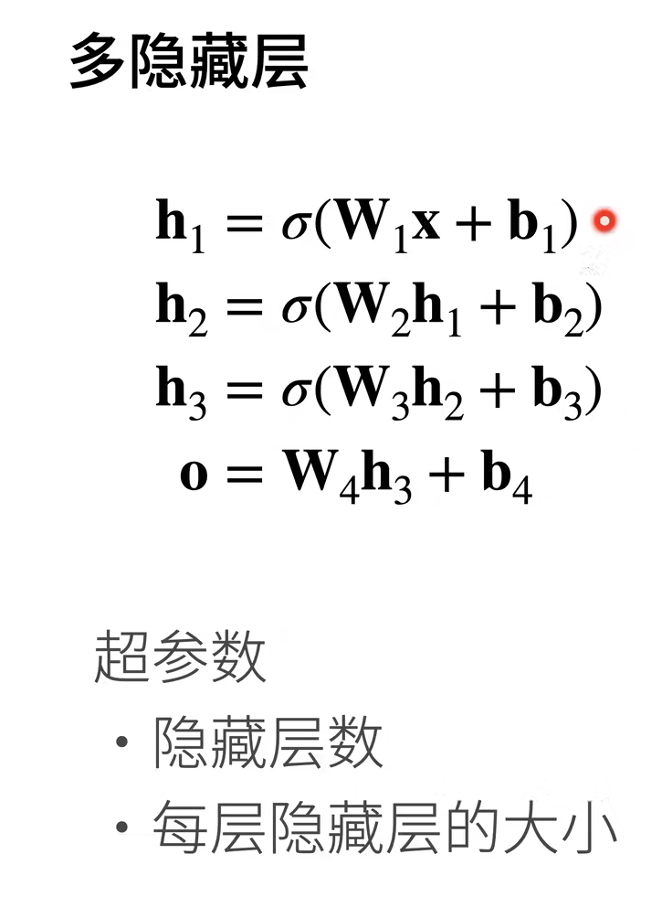

输出层不需要激活函数。

当输入比较复杂：输入128维，输出10维

需要第一层大一些，然后后面的隐藏层不断慢慢变小

缺点：有很多超参数，不好调

so：我们用SVM,对参数不敏感，而且数学很美

SVM在90年代到00年时主流
