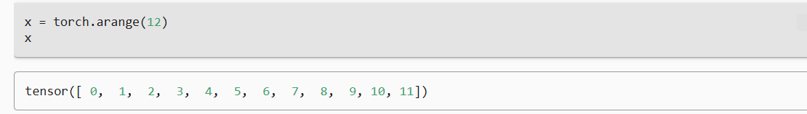
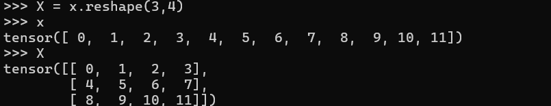
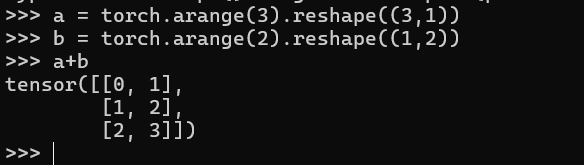

---
title: '预备知识'
date: '2026-06-22'
tags: ['深度学习', '李沐课程']
draft: false
---
## ***数据操作***

张量（tensor） 

**使用arange创建一个行向量张量，默认是从0开始的整数，也可以改变为浮点数**

shapes是张量的长度

size是张量的所有元素

reshape来改变张量的形状，但不会改变大小，可以用-1来自动计算宽度或者高度

全0全1矩阵用torch.zeros和torch.ones

randn是高斯分布

### broadcast机制:

### 索引

和python一样

[1:2] 表示选择第二个和第三个元素

### **节约内存**

`Y = Y + X` 后，`id(Y)` 的数值变了，在深度学习里面很容易导致显存溢出

所以我们需要使用原地操作的方法 

 1：切片赋值`Z[:] = X + Y`
2：自增运算符`X += Y`

### 和numpy之间互相转换

numpy里面也有张量
