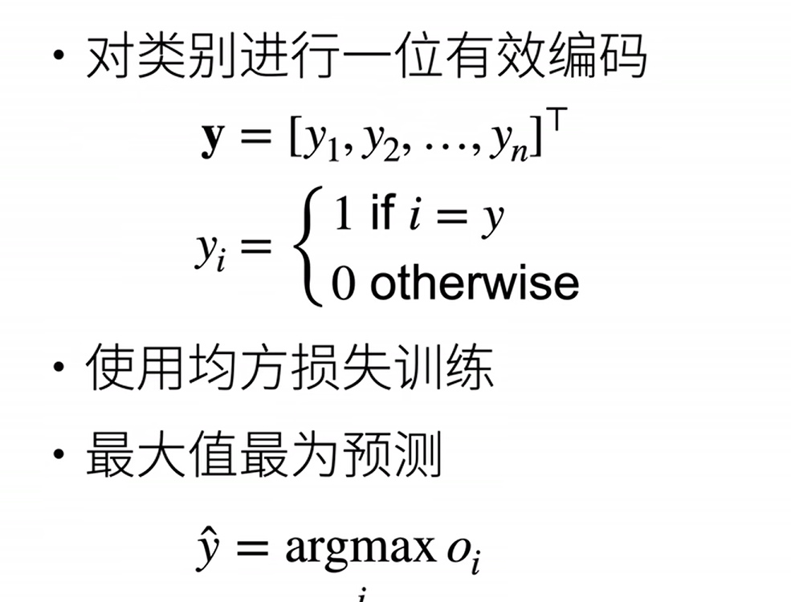
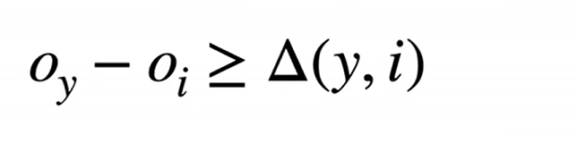
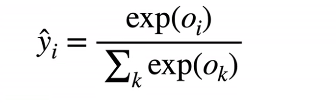
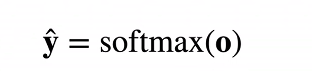
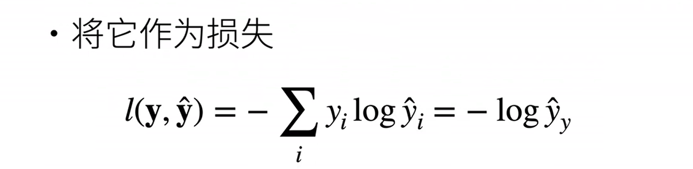
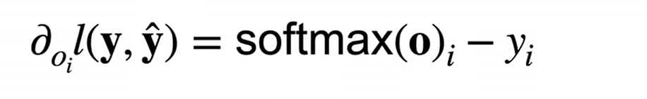
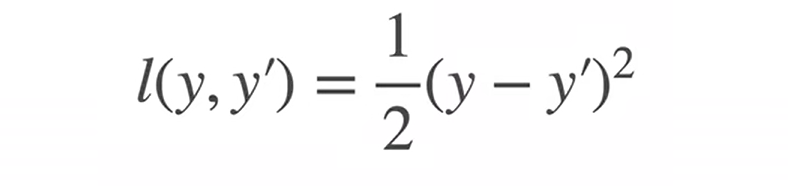
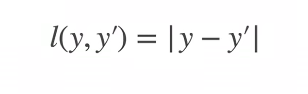
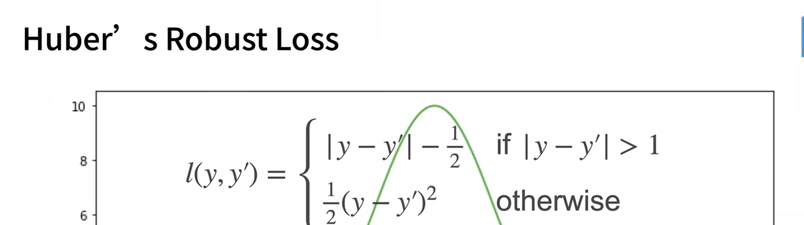

其实是一个多类的分类问题

回归：预测一个输出，损失是真实值和预测值的差值，一般是均方损失

分类：有多个输出，置信度最大的为输出

## **回归-分类**

#### 均方误差

#### 置信度要是最大，大于某个常数

#### 检验比例（softmax）

这样能保证两个
1：用指数能确保非负
2：除以一个求和能保证和为1

向量 **y** 是一个概率

**损失（交叉熵）**

用真实的y和预测的y的区别作为损失，具体是用交叉熵

损失函数的梯度就是真实概率和预测概率的区别，梯度就一直用梯度下降

## 损失函数介绍

1：均方

2：绝对值损失函数

3：huber robust函数

## 输入输出

softmax的输入需要是一个向量，eg.如果是一个通道为1，长度28，宽度28的图片，我们需要把它展平，展平为长度是784的向量 

输出维度可以自己定
