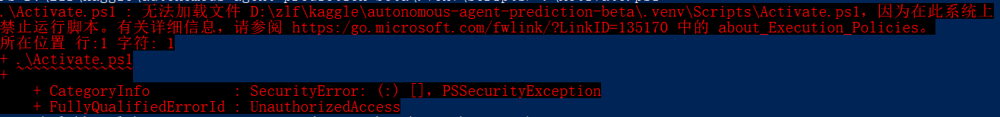
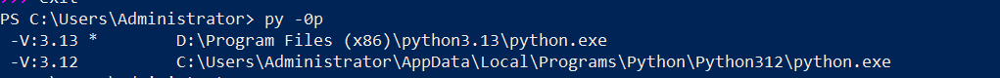

打开powershell

用 cd命令  

`cd D:\zlf\kaggle\autonomous-agent-prediction-beta`

然后

```jsx
python -m venv .venv
```

来创建虚拟环境

`.\.venv312\Scripts\Activate.ps1`

运行这个命令来激活，这个命令有可能会失败，所以我们可以cd到scripts

然后再`.\Activate.ps1`

我知道为什么失败了，因为我的虚拟环境改成venv312了

所以命令应该改成

 `.\.venv312\Scripts\Activate.ps1`

but 遇到了一个问题



原因是：执行策略是Restricted（默认设置）

使用get-executionpolicy命令检查之后发现确实是这样

解决办法：使用set-executionpolicy remotesigned命令

使用 

```jsx
deactivate
```

命令来退出虚拟环境

进入虚拟环境之后，一般 

```jsx
pip install requirement.txt
```

就好了

但是本地包没有装进虚拟环境里面，我们尝试这样来解决

```jsx
python.exe -m pip install --upgrade pip
python.exe -m pip install -r requirements.txt
```

校验

```jsx
python -c "import adk_submission, kaggle_kaggle, pandas, sklearn; print('imports ok')"
```

还是报错

现在找到原因了

因为没有安装项目里的两个本地 wheel

```jsx
python -m pip install .\wheels\adk_submission-0.1.0-py3-none-any.whl
python -m pip install .\wheels\kaggle_kaggle-0.1.0-py3-none-any.whl
```

kaggle_kaggle还是下载失败了，因为baseline用的是python3.12的版本

而我们创建的虚拟环境是3.13

所以我们现在的解决办法是装一个3.12版本的python

```jsx

winget install --id Python.Python.3.12 -e --source winget

py -0p
```



然后创建虚拟环境、激活

```jsx
py -3.12 -m venv .venv312
.\.venv312\Scripts\Activate.ps1

```

名字改成312

安装依赖

```jsx
python -m pip install --upgrade pip setuptools wheel
python -m pip install -r requirements.txt

```

还是失败了，失败的真正原因是

```jsx
litellm-1.92.0.tar.gz

```

pip下载到的是litellm源码包，而不是Windows预编译wheel。安装源码包时，它需要Rust和Cargo编译扩展，但当前系统的Cargo不在可用PATH中.

由于kaggle_kaggle依赖litellm，所以整个wheel安装事务中止

解决办法是

固定安装有Windows预编译wheel的litellm==1.83.14，所以在requiement上也需要同步修改
