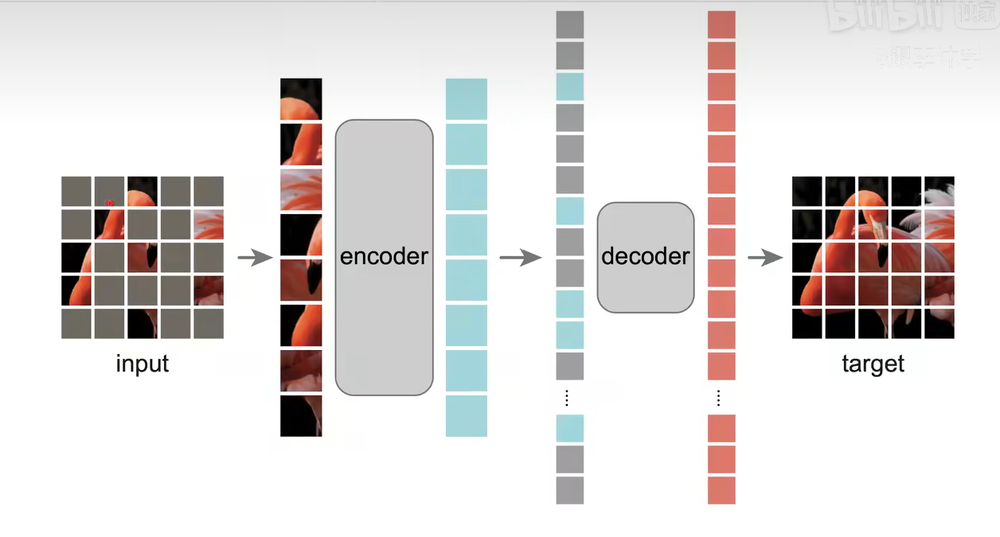

---
title: 'MAE'
date: '2026-07-17'
tags: ['论文精读', 'CV']
draft: false
---
## 背景

如果把VIT看成CV上的transformer

那么MAE就是CV上的BERT

相比与VIT是把训练数据拓展到没有标号的数据上面

## 摘要

Mask AutoEncoder

方法很简单，随机的去盖住一些块，然后再去重构这些被盖住的像素，思想来自于BERT

预测的是patch里面的所有的像素。

有两个核心的设计

1：有一个非对称的编码器和解码器

BERT里面的解码器是最后的全连接输出层

**我的编码器只作用在没有掩码的patch（所以能加倍3倍左右）**，解码器比较轻量

2：如果mask的块很多的话，能学到的东西更多

效果比有标号，有监督的好

在迁移学习的效果也很好

### 最重要的一张图

cv领域一般是直接放到右上角

encoder是VIT的模块

编码器的计算量比较大一点

这些是预训练的流程

我们要用这个模型的话呢就直接用encoder模块就好了，他输出的就是图片的特征， 因为我们的图片没有mask，所以不需要decoder

## 结论

。。

没有什么有用的信息

## 引言

在NLP里面，自监督已经用的很广泛了

但是在CV领域，自监督用的少，why 带掩码的自编码器在NLP和CV上有不同呢？

1：直到最近以前，CV方面用的都是CNN，卷积窗口是不好放mask的  ——VIT已经解决了

2：CV和NLP的信息密度不一样，所以我们创造了一个很有挑战性的任务，把很多patch都掩码掉了

3：CV上面输出的就是全连接层输出的特征图，层次很低。但是NLP里面输出的就是一个一个词。

所以基于这些，我们提出了MAE，非对称的编码器和解码器的意思是：编码器看到的只是可见的，解码器看到的是全部的

## 相关工作

1：masked language model ：GPT,BERT

2：autoencoder: PCA，DAE

3：image masked encoding：IGPT，VIT

4：self-supervised learning： contrastive learning

*沐神建议：写相关工作时，把自己的工作和别人的工作要做一个区分，体现出自己不一样的点*

## 架构

前面的见图

### 解码器

解码器的最后一层是线性层，如果一个patch是16x16，那么这个线性层就会投影到长是256个维度，再reshape一下就可以了

损失函数用的是MSE。只在被改住的地方做MSE

后面讲的就是实验了
