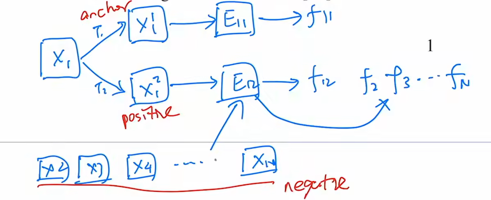
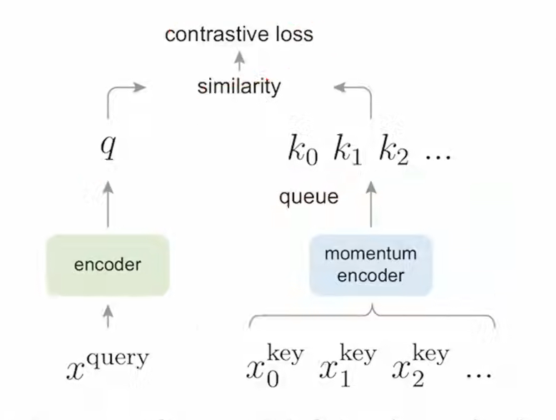
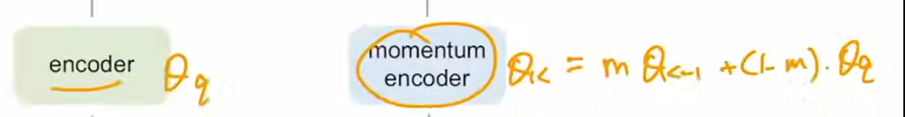

---
title: 'MOCO（没太看懂对比学习）'
date: '2026-07-18'
tags: ['论文精读', 'CV', '对比学习']
draft: false
---
## 背景

### 对比学习

相邻的物体在一个区域，不相邻的物体在另一个区域

对比学习不需要知道标签信息

但是训练的时候需要有监督？不然怎么确定两个物体相似 —-会人为的去设定一些规则，代理任务，来满足自监督训练

#### 代理任务

eg. instance discrimination

随机挑选一张图，对他做裁剪和数据增强，得到两张语义信息不发生变化的正样本

对剩下的样本来说都是负样本

然后经过一个模型得到一个特征，最后在这些特征上，使用一些常见的对比学习的目标函数，eg.NCE loss

##### 灵活性

代理任务可以随便选， 自己定义正负样本

## 摘要

linear protocol  一个测试办法

moco学到的特征可以很好的迁移到下游任务！！

## 引言

NLP领域，GPT和BERT已经证明了，无监督学习很厉害，但是CV里面不太行。因为NLP里面，词是低维的，而且有很强的语义信息。但是在CV，图片的信息是高维的，没法去浓缩成很好的语义信息，很难建模

*把对比学习当成动态字典*

字典需要大

key需要有一致性

queue

用到了queue的数据方式，因为字典要是很大的话，显存吃不消，队列能让现在的batch抽到的特征进入队列，同时让最早的batch抽到的特征移出队列

momentum encoder

把m设置的尽可能设立为靠近1

## 相关工作

无监督学习有两个方向
1：代理任务
2：目标函数

moco主要是研究目标函数

1：对比型的目标函数

2：对抗型

## 方法

损失函数

info NCE
