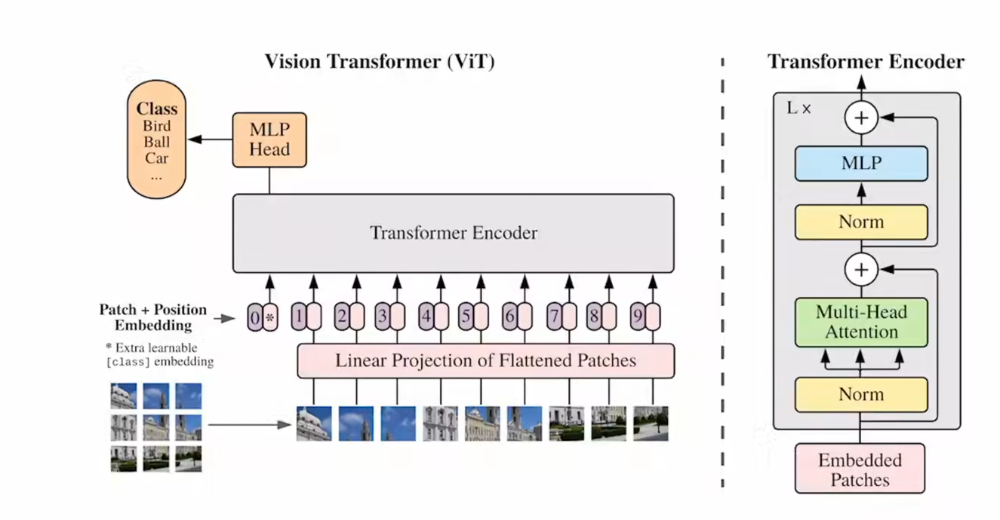
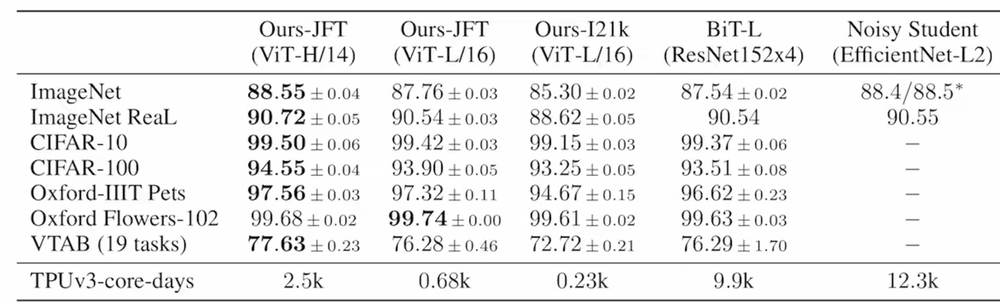

---
title: 'ViT'
date: '2026-07-16'
tags: ['论文精读', 'CV']
draft: false
---
## 摘要

先在大规模的数据集上做预训练，然后再做迁移学习，已经可以和最好的卷积神经网络效果一样了，VIT需要很少的训练资源（PS：真的吗？  实际上需要2500天TPU V3 的训练时间）

## 引言

现在的CV普遍方法是在一个大规模的数据集上做预训练，然后在小规模的数据集上做微调—（BERT的思想）

---

回顾一下transformer

输入的各个元素做两两相互的自注意力图，计算复杂度和序列长度是O（n^2）倍

所以现在最多也就512的长度

如何把2d的图片变成1d的向量？

把每一个像素当成一个序列元素

这样有一个问题，每一张图片大小大概是224x224，这样的序列太长了，远远超512

---

其他的一些工作

把网络输出的特征图来当transfomer的输入

用局部图来当输入

把2d图片变成两个1d的向量

我们的工作

用一个标准的transform，做很少的修改。把图片分成很多个patch，每一个patch的大小16x16

用patch来当元素。等价于句子里面的单词

使用的是有监督的训练

在小的数据集下，resnet的效果更好，因为CNN有两个归纳偏置

在大的数据集下，vit效果更好

## 相关工作

VIT的工作最重要的区别是：把CV领域完整的用NLP的方法去实现

挖坑，还有一些CV的工作没人做

1：目标检测

VIT-FRCNN

2：分割

SETR

从此CV和NLP大一统了——-后面引出多模态

BERT 用的是”完形填空“的思想去做自监督的预训练

GPT用的是language modeling 的方法（预测下一个词）去做自监督的预训练

数据是人为定的，人为的去在完整的句子里面划掉一些词

## 架构

假如我们有一个224x224x3的图片进来，3是RGB的通道

patch-size大小是16x16

最后一共会有196个图像块，每一个图像块的维度是16x16x3 = 768

然后经过一个线性投射层，其实就是一个全连接层，它的维度是768x*768（后面的768是可以变的，前面的768不变）*

然后输出一个patch-embedding  【196x768】x【768x768】 = 196x768

有196个token，每一个token的维度是768维

然后需要加一个【CLS】的token，【CLS】的token的维度也是768

最后的输出就是（196+1）x768

位置编码不算是token，而是一个表，每一个表是一个向量，把位置信息加到向量里面，是直接加，而不是拼接，所以最后序列还是197x768

所以Transfomer Encoder的输入Embedded Patches的输入就是197x768的tensor

过了一个normalization之后不变 197x768

再过一个多头自注意力，分成了三份K,Q,V，每一份都是197x768，假定一共有12个头，所以每一份就是768/12=64  所以每一个头的K,Q,V的大小就是197x768，这样下来12个头的输出直接拼接起来，又变成了197x768

再过一个layer nomalization 不变

再过一个MLP，MLP一般会把维度放大，一般放大4倍，197x3072

再缩小回原来的输入

这些就是一个Transfomer Encoder，所以可以叠很多个Transfomer

把图片分成不同的patch，去做自注意力，但是我们发现两两做自注意力是没有顺序之分的

图片不同的patch却是有顺序的。所以我们需要有一个position embedding

和BERT类似，这里也有一个【cls】来作为最后的输出

*MLP和CLS那里怎么加的没看懂。还有一个最开始的全连接层*

[*ViT论文逐段精读【论文精读】_哔哩哔哩_bilibili*](https://www.bilibili.com/video/BV15P4y137jb?spm_id_from=333.788.videopod.sections&vd_source=3c665962117e5851c29c76815fad1a61)

CLS其实也可以用传统的卷积神经网络里面的global average pooling层去替换

位置编码也可以用其他的

### 微调

把预训练好的VIT模型微调到更大的图片

理论上来说可以，但是会有一个问题，如果patch的大小不变，会导致patch的数量增多，导致位置编码出现了问题，解决办法是做插值

## 实验

实验做的主要是分类，数据集是image-net和JFA

patch-size是很重要的超参数，越小训练就越贵

效果都是最好，但是也没有好多少，所以就强调训练起来更便宜

VIT需要用很大的数据集，小的数据集还是用Resnet上效果好一点
