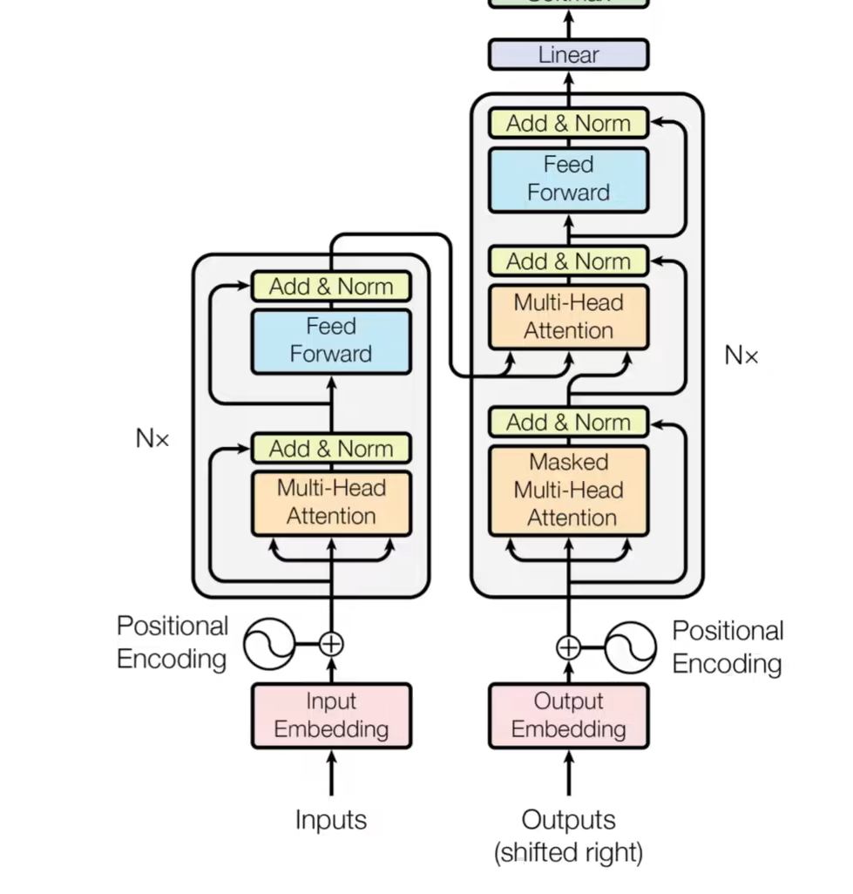
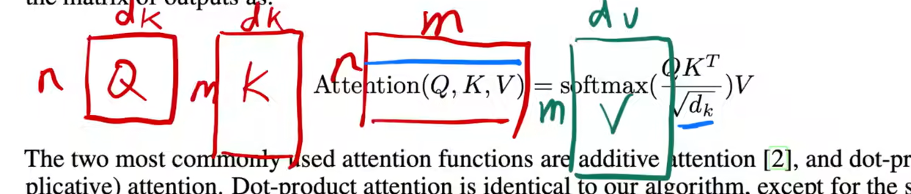
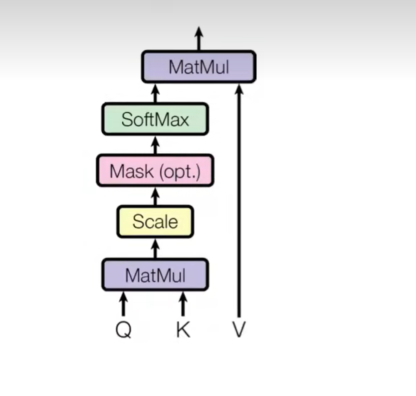
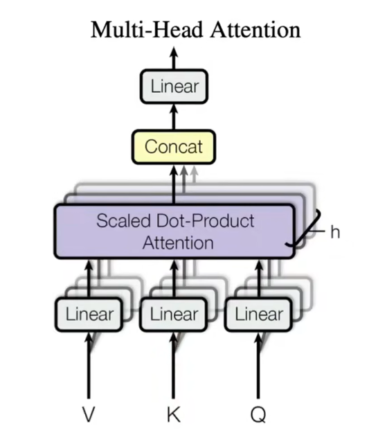
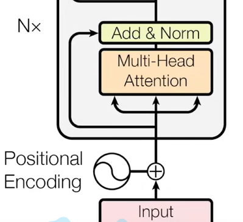
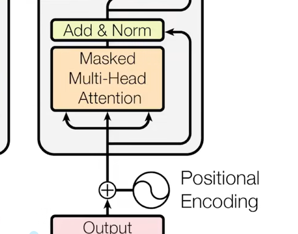
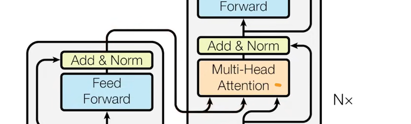

序列到序列的生成，比如机器翻译

### encoder

把输入变成机器学习可以理解的向量

### decoder

把向量变成序列，但是用到了自回归：过去的输出成为了现在的输入

### laynorm（）和batchnorm的区别？

## 架构

mask掩码的作用是让看不到t时刻之后的数据

### 注意力

**具体矩阵的计算**

### mask

mask的作用就是把t时刻之后的值换成一个非常大的负数，这样能够保证在算softmax的时候，这些权重变成0

### muti-head Attention

用不同的投影去学习不同的模式

投影完之后去计算注意力函数

然后再投影回来

#### 三个不一样的muti层

**encoder层**

三个输入，是输入向量的Q,K,V，但本质上是一个东西复制成三份——自注意力机制

一个输出，是输入的加权和，权重是自己本身和其他向量的相似度

在有多头的情况下，会有不同的学习空间

**decoder层**

和encoder一样，只是多了一个mask

#### ？

输入的K,V来自编码器的输出，Q来自与解码器下一层的输出

### Feed-forward

本质上是一个MLP，单隐藏层的MLP

### embedding

把任何一个词学习一个长度为d的向量来表示他

### positional encoding

为了把时序信息加进来

## 面试20问

1. Transformer为何使用多头注意力机制？（为什么不使用一个头）
2.Transformer为什么Q和K使用不同的权重矩阵生成，为何不能使用同一个值进行自身的点乘？ （注意和第一个问题的区别）
3.Transformer计算attention的时候为何选择点乘而不是加法？两者计算复杂度和效果上有什么区别？
4.为什么在进行softmax之前需要对attention进行scaled（为什么除以dk的平方根），并使用公式推导进行讲解
5.在计算attention score的时候如何对padding做mask操作？
6.为什么在进行多头注意力的时候需要对每个head进行降维？（可以参考上面一个问题）
7.大概讲一下Transformer的Encoder模块？
8.为何在获取输入词向量之后需要对矩阵乘以embedding size的开方？意义是什么？
9.简单介绍一下Transformer的位置编码？有什么意义和优缺点？
10.你还了解哪些关于位置编码的技术，各自的优缺点是什么？
11.简单讲一下Transformer中的残差结构以及意义。
12.为什么transformer块使用LayerNorm而不是BatchNorm？LayerNorm 在Transformer的位置是哪里？
13.简答讲一下BatchNorm技术，以及它的优缺点。
14.简单描述一下Transformer中的前馈神经网络？使用了什么激活函数？相关优缺点？
15.Encoder端和Decoder端是如何进行交互的？（在这里可以问一下关于seq2seq的attention知识）
16.Decoder阶段的多头自注意力和encoder的多头自注意力有什么区别？（为什么需要decoder自注意力需要进行 sequence mask)
17.Transformer的并行化提现在哪个地方？Decoder端可以做并行化吗？
19.Transformer训练的时候学习率是如何设定的？Dropout是如何设定的，位置在哪里？Dropout 在测试的需要有什么需要注意的吗？
20解码端的残差结构有没有把后续未被看见的mask信息添加进来，造成信息的泄露。
