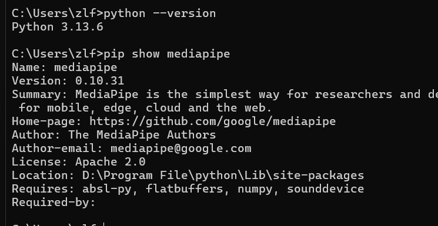
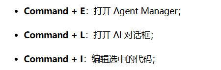
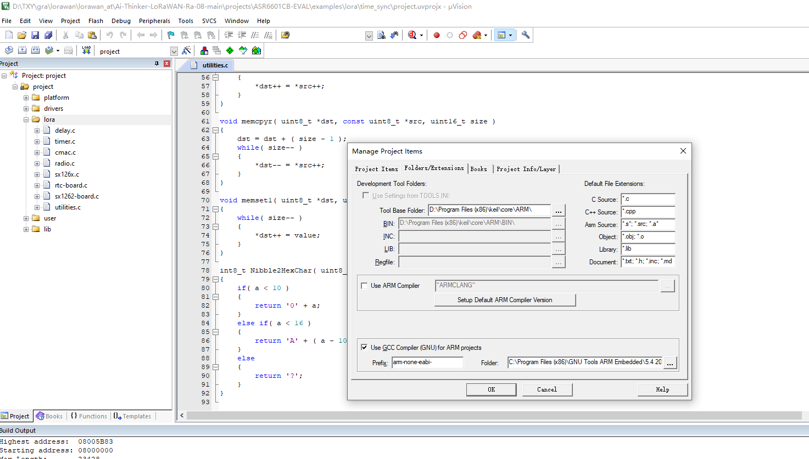
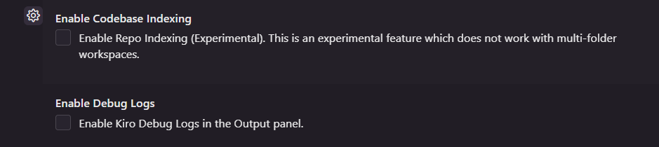
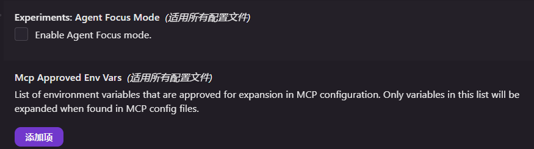
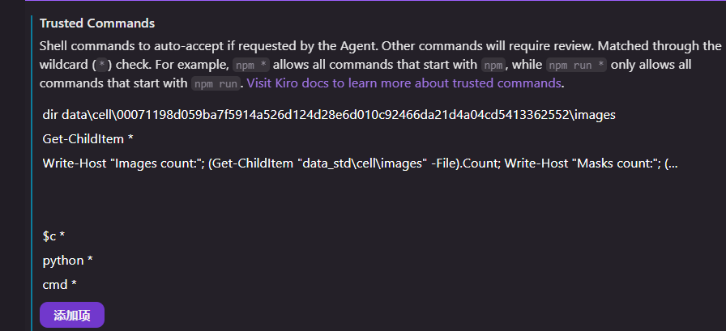

---
title: '各种问题汇总'
date: '2026-01-03'
tags: ['踩坑']
draft: false
---
1：clash for windows关闭global之后，无法正常上网？

原因：电脑关机的时候没有关闭clash for windows

解决办法：通过这个命令行netsh winsock reset来重启网络协议配置
具体原理暂时未知

2：pycharm & python安装

python版本：3.13.6
pycharm版本：2025.2
遇到的一个问题，配置解释器失败
原因：忘记安装python了
解决：安装python，自动识别到解释器

参考文章:

[https://blog.csdn.net/m0_62283350/article/details/148498274](https://blog.csdn.net/m0_62283350/article/details/148498274)

.3：window重装之后安全中心打不开

原因：丢失了安全中心的包

解决思路：直接重装安全中心，先查看自己的系统信息“此电脑-系统“打开[https://uupdump.net/](https://uupdump.net/)

选择自己系统的版本号，搜索Microsoft.SecHealthUI，下载后改后缀为.appx

4: 申请geminipro免费使用一年的教程（待完成）

目前问题：google给我的ip地址锁定为了日本
尝试解决：向google提交了改地址的请求

5：ic设计软件安装合集（待完成）

linux版本 ：16.04
vmware版本：25H2
虚拟机分配：2核8线程，6G内存
网络用桥接网络，因为主要用wifi联网

6：vivado下载安装

各个版本安装包见下：

[Vivado全版本下载分享 - FPGA狂飙 - 博客园](https://www.cnblogs.com/fpga-soaring/p/17489915.html)

问题描述：下载安装包之后里面有很多压缩包，应该怎么解压呢？
解决：好像只用解压一个就好了，可以正常安装打开，安装过程就不多说了，正常安装就好了

lic文件我放到"D:\vivado2020.1\lic2037”这里了

参考网址在这里
[GitHub - yhsc0001/Vivado2037nianzhiqianbanbenyongjiupojieLicensewenjian](https://github.com/yhsc0001/Vivado2037nianzhiqianbanbenyongjiupojieLicensewenjian?tab=readme-ov-file)

问题描述：set up点不开
原因：在文件的太里面了
解决办法：把安装包放到根目录

7：java安装（待完成）
vscode里面和java相关的插件：Extension Pack for java，Spring Boot Extension Pack，从[https://www.cnblogs.com/javastack/p/19396292](https://www.cnblogs.com/javastack/p/19396292) 这个网站上看到的。

jdk下载：我下的是jdk17
ide：下载intell2025.2

已经配置好了环境变量

安装参考网站
[【入门篇】一键搞定 Java 环境配置，从 0 跑出你的第一个程序-腾讯云开发者社区-腾讯云](https://cloud.tencent.cn/developer/article/2607468)

8：antigravity环境的配置

关于work flow ：输入 `/` 就会弹出所有的 Workflows：
gravity的配额工具查看：安装插件wusimpl Antigravity Quota Watcher 作者wusimpl
[https://github.com/wusimpl/AntigravityQuotaWatcher](https://github.com/wusimpl/AntigravityQuotaWatcher)

9：pycharm突然崩溃
问题描述：PyCharm 启动时，内置的 JetBrains Runtime (JBR / Java 21) 因“本地内存（Native Memory）耗尽”而直接崩溃。

问题解决：修改 PyCharm 的 vmoptions “D:\Program File\pycharm\data\PyCharm 2025.2\bin\pycharm64.exe.vmoptions” 改成

- Xms256m
-Xmx1536m
- XX:ReservedCodeCacheSize=256m
-XX:+UseG1GC
- XX:HeapBaseMinAddress=8g

10：google Error Verifying reCAPTCHA解决
问题原因：谷歌无法进行人机验证
解决办法：使用google浏览器无痕浏览，再挂一个梯子，就能解决了

11：c语言环境配置
参考文档:
[【2025版】超详细MinGW-w64安装保姆级教程，永久免费使用，C++编译环境配置和使用指南，看完这一篇就够了 - 掘金](https://juejin.cn/post/7560986017035468843)
我下载的**MinGW-w64是 X86_64-15.2.0
文件保存到了D盘 D:\Program Files (x86)\c\c\mingw\pack
直接安装解压即可
注意：需要配置环境变量，就是把bin文件的地址存到path里面**

12：python工程问题汇总（不断完善）

（1）：我在task6文件夹的工程，项目显示的却是task3
解决：这是正常的现象
（2）：安装了一个模型到全局里面，但是依旧跑不了
原因：装库”的地方和你“运行代码”的地方是两个不同的地方
解决办法：1：把库装进**这个特定路径**的 Python 里
2：尝试重启一下pycharm（没尝试过）

13：win10禁用驱动签名
按住shift 点击重启，点击高级设置，启动选项
按7

14：keil环境配置

首先要有一个破解软件解决license问题

再在网上下载GNU，再点击manage

然后网上下载一个ARM CMSIS的包，点击安装即可

需要注意！不能点击到bin文件夹！！！错两次了！！！！

15：开了梯子但是打不开kiro，antigravity

需要打开tun模式

16:有关kiro设置

C:\Users\zlf\.kiro
这些是一些配置文件、

**一些设置说明**

Enable Codebase Indexing (启用代码库索引)

勾选后，Kiro 会扫描你整个代码仓库，并在本地建立一个“语义索引”（类似向量数据库）。这样当你在聊天框里问“帮我检查一下数据采集模块的逻辑”时，即使你没有明确指出是哪个文件，Kiro 也能自动去浩如烟海的代码里把相关文件找出来作为上下文（Context）。

Enable Debug Logs (启用调试日志)

勾选后，会在 IDE 的“输出 (Output)”面板中新增一个 Kiro 的专属频道。Kiro 在后台向大模型发送的具体 Prompt 是什么、检索了哪些文件、模型返回的原始 JSON 数据是什么，都会事无巨细地打印在这里

我勾选了启动

## Experiments: Agent Focus Mode (实验性：智能体专注模式)

- **字面意思：** 这是一个实验性功能。开启后，Kiro Agent 会进入“专注模式”，尽可能地收窄自己的注意力，只关注与当前直接对话和任务最核心相关的文件，减少发散。

## Mcp Approved Env Vars (MCP 允许的环境变量列表)

- **字面意思：** 这是一个安全白名单。我们在前面提到过 MCP（让 Kiro 连接外部工具的协议）。在配置 MCP 的 JSON 文件时，有时会用到系统的环境变量（比如某种工具的安装路径，或者 API 密钥）。这个列表决定了**Kiro 只允许读取和解析哪些特定的环境变量**，列表之外的变量将被严格拦截。

